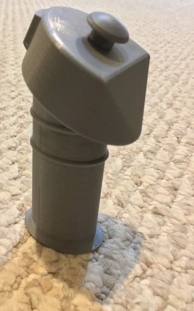
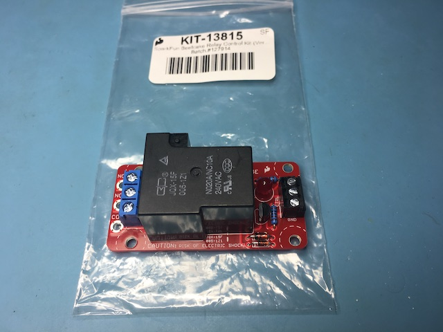
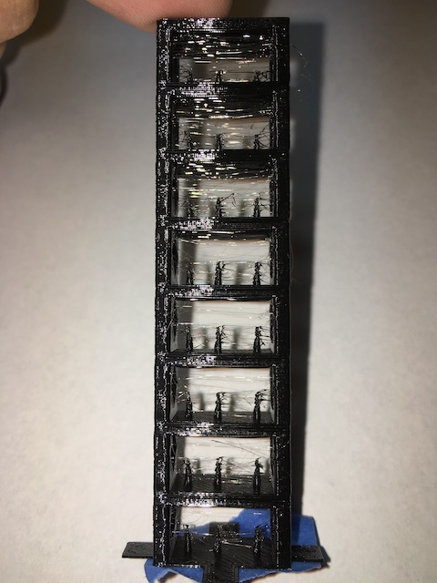

<br>
Tracking the build of my robot to compete in the
[Seattle Robotics Society's Robo-Magellan](https://robothon.org/rules-robo-magellan/) competition that was to be held on October 3rd, 2020 at the Seattle Center but is now cancelled due to COVID-19. Development of this robot will continue in hopes that it can compete in the future.


## Points of Interest
[SRS Robo-Magellan rules](https://robothon.org/rules-robo-magellan/) <br>
[Notes about our 2014 bot](https://github.com/adamgreen/Ferdinand14#readme) <br>
[Notes from my stalled 2016 attempt](https://github.com/adamgreen/Ferdinand16#readme) <br>
[How to Clone GitHub Repository](#clone-this-repo-and-its-submodules) <br>
[Sawppy the Rover Build Instructions](https://github.com/Roger-random/Sawppy_Rover#readme) <br>


---
## June 27th, 2021
### I2C? What I2C?
The next task I set myself upon was wiring the IMU into the LPC1768 on my Sawppy bot so that I could use it with the [dead reckoning code that I wrote for the Ferdinand16 project](https://github.com/adamgreen/Ferdinand16/tree/master/firmware/robot). When I was working with the IMU hardware back in April, I had it connected to a dedicated LPC1768 on a breadboard and not the one already wired up to my bot. When I went to move it over to the LPC1768 microcontroller on the Sawppy bot, I hit a snag. All of the I2C capable pins on the microcontroller were already being used for their UART functionality: LX-16A servos/motors, MRI debug monitor, and PDB communication.

### Bridge It
In the future, I plan to create my own PCB for the LPC1768 based brains of my bot which will give me access to more pins of the microcontroller. In the meantime, I would like to continue prototyping with the mbed based board that I already have. How can I work around the lack of free I2C pins? It turns out that I still have one set of SPI pins available. Using another microcontroller, I could create a bridge device that reads the IMU sensors via I2C and then sends the resulting readings to my main microcontroller over SPI.

#### LPC1768 as SPI Slave
My first attempt at building this bridge was to use another mbed LPC1768 microcontroller as a SPI slave. When I originally skimmed the mbed SPISlave class documentation I was kind of confused on how to really use it. I then read the LPC1768 User Manual and was even more confused. I tried for several days to get the LPC1768 to reliably send data back to the SPI master but ended up throwing in the towel. I just don't think the SPI peripheral on the LPC1768 hardware is designed properly for use in slave mode:
* There is no way to get an interrupt when the master sends a single byte request. It will only interrupt when the Rx buffer overflows, the Rx FIFO is half full, or 4 byte times have elapsed since the last received byte.
* It is really hard to queue up the Tx data at the right time and if you don't have it queued in time because your code is busy doing something else, the peripheral just takes the oldest already sent data from the Tx buffer and sends it instead.

In the end, I gave up on the LPC1768 and decided to research using another microcontroller from my stash.

#### nRF5x as SPI Slave
I had an [Adafruit Feather nRF52 Pro with myNewt Bootloader - nRF52832](https://www.adafruit.com/product/3574) in my stash of development boards so I pulled up its SPI slave documentation. What I saw there looked very promising:
* You can specify what data should be returned when you have no active data queued up to be sent back.
* Once you do have data to be sent, you queue it all up at once with the help of EasyDMA.

I ported my I2C sensor reading code to the nRF52832 and quickly implemented the SPI bridging code. The SPI Slave functionality on this device worked exactly as expected and I soon had a functional bridge setup between the bot's main LPC1768 and the nRF52 bridge.


Now to get it all installed back on my bot and start writing some dead reckoning code :)


---
## June 4th, 2021
### LX-16A Encoders
 <br>

The [LX-16A servos](https://www.hiwonder.hk/collections/servo/products/hiwonder-lx-16a-serial-bus-servo) used in the [Sawppy Rover](https://github.com/Roger-random/Sawppy_Rover#readme) design have a potentiometer that can be used for reading out the current angle but it can't accurately read all 360 degrees of the rotation. It returns accurate readings between -40 and 280 degrees (320 degrees of rotation) but not such accurate readings for the other 40 degrees of rotation. There are 2 types of inaccurate readings that it returns when in the range between 280 and -40 degrees (the deadzone):
* It will return angle values that fall between 280 and -40 as expected but they aren't accurate. This is the most common case and is easy for me to detect in code. I suspect that there is a carbon arc for the section where it returns correct values (-40 to 280 degrees) and maybe just copper at the two extremes where it returns these incorrect readings. The following diagrams show what I think the internals of the potentiometer look like and where the wiper is located for a few key angles:
  * 280 degrees: This is the maximum valid angle. The potentiometer wiper is contacting the carbon resistive track. <br>
  * -40 degrees: This is the minimum valid angle and shows the potentiometer wiper at the other end of the carbon resistive track. <br> 
  * -50 degrees: This is an angle in the deadzone. The potentiometer is no longer on the carbon resistive track but is also not floating. This explains why the readings back from the LX-16A servo tend to fall around -40 or 280 when in the deadzone since this area of the track is at either the maximum or minimum voltage level since there is so little resistance to the end taps. <br> 
* It will return random angle readings that can fall anywhere in the 360 degree range. I suspect that this happens when the potentiometer wiper is left floating in a gap that must exist between the two ends of the potentiometer to stop the wiper from creating a short between the high and low voltages applied to the opposite ends of the potentiometer. This isn't a common case and is hard to detect in code but we do know that it happens when previous readings place it in the deadzone and the wiper shouldn't dwell in this area for long at the velocities and sampling times that will be used for controlling my robot's motion. <br> 

I tried two methods to work around these inaccurate readings and I will give an overview of them below.

#### Kalman Approach
 <br>
As the old saying goes, "When all you have is a hammer, everything looks like a nail." In my case, my hammer of choice has become the Kalman filter. So my first thought to solve the LX-16A servo encoder problem was to apply a Kalman filter to calculate the current rotational position and velocity. To this end, I started out by re-reading my ["Kalman Filter for Beginners with MATLAB Examples" by Phil Kim](https://www.amazon.com/Kalman-Filter-Beginners-MATLAB-Examples/dp/1463648359). I really like this book. The content is very good. The only down point is the Korean to English translation could use quite a bit of improvement. Once I finished the reread, I wrote up some code to experiment with the Kalman filter which can be seen in the following [commit](https://github.com/adamgreen/Ferdinand20/commit/b95c3b9d9873d6a039cecfaa98e94790804dd103). I played with this code for a few days but I never got the error estimates to a point where the rotational velocity estimate wasn't overly filtered with a lagging response to real world velocity changes. Based on these results, I decided to try another approach which can be best described as a bunch of conditional hacks.

#### Conditional Hacks
The key observation that I take advantage of in my set of hacks is the following:
* If the angle returned from the LX-16A servo is between -40 and 280 degrees, then most likely it is within +/-0.24 degrees (1 lsb) of the actual real world position.

This means that my code treats such position measurements as the truth and uses them to estimate the velocity. There is one exception to this and I will discuss it more later.

The second observation is very much related to that first one:
* If the angle returned from the LX-16A servo is instead between 280 degrees and -40 degrees then it is in a deadzone where the returned values are much less accurate.

When my code detects that the returned position readings are in this deadzone, it uses the previous position and velocity estimates and sampling time to calculate new position estimates by assuming constant velocity between the samples.

The handling of those two angle ranges gets us most of the way to a solution but I needed to add a few more conditional hacks to produce a functional filter:
* When the wiper is in the middle of the deadzone, it will be floating and returning completely random values that fall in or outside of the deadzone. I have the code ignore the first non-deadzone sample when the previous sample was from the deadzone. If this ignored non-deadzone angle is followed by another then the code transitions into the non-deadzone logic previously described. This does mean that the first good angle reading is always dropped when transitioning out of the deadzone but that is a small price to pay for filtering out these completely erroneous readings. I only expect a single erroneous reading caused by a floating wiper when the rover is moving since there should be a very low likelihood that the wiper stays in this region for multiple samples as the motor is rotating.
* Don't update the velocity until it has two or more non-deadzone position readings. The last interpolated position from the deadzone logic might be so incorrect that it would result in a very bad estimate of the velocity.
* Use an exponential recursive moving average filter to smooth out the velocity calculations. We don't want high frequency noise in this calculation to later impact the PID control loop.

```c++
void LX16A_DriveMotor::updateState()
{
    // Calculate time since last running of the filter and grab the current servo position in close temporal
    // relation to the time capture.
    int16_t servoPos = m_servo.getPosition();
    uint32_t currSampleTime = m_timer.read_us();
    uint32_t elapsedMicroSec = currSampleTime - m_lastSampleTime;
    m_lastSampleTime = currSampleTime;
    float dt = (float)elapsedMicroSec / 1000000.0f;

    EncoderState prevState = m_currState;
    if (ignoringNonDeadZoneSamples(servoPos) || isServoInDeadZone(servoPos))
    {
        // The servo position could be off by as much as +/-20 degrees when in dead zone of the pot.
        // Assume that the motor is still spinning at the same rate when in dead zone.
        m_currState.angle = constrainAngle(prevState.angle + prevState.velocity * dt);
        m_currState.velocity = prevState.velocity;
        m_wasInDeadZone = true;
        printf("*");
    }
    else
    {
        // The pot reading should be accurate so use it.
        m_currState.angle = constrainAngle(servoPos * LX16A_SERVO_TO_RADIAN_VALUE);

        if (m_wasInDeadZone)
        {
            // Don't want to base current velocity off of previously interpolated position.
            m_currState.velocity = prevState.velocity;
        }
        else
        {
            // Calculate velocity from change in angle and then use weighted average so that it doesn't snap too much.
            const float weight = VELOCITY_AVERAGING_WEIGHT;
            float angleDelta = constrainAngle(fmodf(m_currState.angle - prevState.angle, 2.0f*(float)M_PI));
            float velocity = angleDelta / dt;
            m_currState.velocity = (1.0f-weight)*m_currState.velocity + weight*velocity;
        }
        m_wasInDeadZone = false;
    }

    updatePID(dt);
}
```

I may have to add code in the future to handle the motor being stopped when in the deadzone or even worse, stopped right at the point where the potentiometer wiper is left floating. I will cross this bridge once I encounter it so that I have scenarios to use for testing my attempts to resolve it.

### Closing the Loop
Once I had a way to obtain a reasonably reliable estimate of the servo's rotational velocity, I pulled over my PID code from my old [Ferdinand16 repository](https://github.com/adamgreen/Ferdinand16#readme). The biggest changes I made to this code after copying include:
* Now allowing the sample time to be changed between PID updates as the frequency of the LX-16A servo position reads may not be as consistent as my previous uses of the PID control algorithm.
* Ferdinand16 required the angle error to be normalized between +/- 180 degrees and the PID code had this hardcoded into it. I updated the code to take an optional callback for performing such normalizations when required. It isn't required for LX-16A motor velocity control.

Now that I had a way to close the loop on the control of the motor velocities, I went into the existing ```SawppyDrive``` class and plugged in my new ```LX16A_DriveMotor``` class for controlling the 6 servos that spin the wheels (while leaving the 4 turning servos as is). Once this switch had been made, I could drive my Sawppy bot around by remote control as before but now the wheel velocities were running under closed loop control.

### MRIPROG / BLEMRI Issues with new macOS and MRI Updates
When I started testing the new PID code on my actual Sawppy based robot, I hit a few issues with my Bluetooth Low Energy (BLE) programming/debugging tools that I had to address first. It turns out that it needed updates to work with the newer version of my [MRI debug monitor](https://github.com/adamgreen/mri#readme), my new MacBook Air, and Big Sur updates:
* I updated **mriprog** to move the entry point for the LPC1768 bootloader into entry.S so that I can use assembly language code to initialize the stack pointers (MSP & PSP) to the desired value since the current MRI doesn't allow for modifying the stack pointers from GDB. Once the stack pointers are set, it just branches to the original main() code.
* MRI now contains 6 more special registers in the context (MSP, PSP, PRIMASK, BASEPRI, FAULTMASK, CONTROL). I updated **mriprog**'s gdbRemote module to take these into account.
* When my new laptop communicates with the nRF51 BLE to UART bridge, it tends to corrupt a few packets that need to be resent. I made a few updates to **mriprog** to better handle these resends:
  * Instead of reporting each packet error encountered, just count them and report the number of retries at the end along with the other statistics.
  * Reduce PACKET_MAX_DATA from 16k to 4k so that if the CRC fails on a packet then less data needs to be resent.
* I updated my **blemri** code to handle a BLE change introduced with Big Sur. Once the Mac has been connected to a BLE device such as BLEMRI, Big Sur only returns the information that it cached on the first connection and this doesn't include the 128-bit service UUID from the scan response. My code used this UUID for filtering when performing BLE device discovery. I modified the firmware to no longer advertise the unique service UUID and now just advertise the Nordic UART service UUID actually supported by the device as it is no longer of use for filtering. I now have the application running on macOS perform BLE discovery with no filtering and then check the local device name on each discovered device, looking for ones named BLEMRI.
* I increased the minimum and maximum connection interval from 7.5ms to 15ms in my BLEMRI firmware to meet the Apple design recommendations. My iPhone is now able to stay connected for over 100 seconds. My iPhone would previously drop the connection when it couldn't agree with the device on connection parameters. This change doesn't decrease the throughput that much as BLE allows multiple packets to be scheduled per interval. It would increase the turn around time to get the response back from commands. The throughput is still above 5kB/s after this change so I will keep it.
* I copied the **mriprog** utility from my [older BB-8 project](https://github.com/adamgreen/bb-8/tree/master/mriprog) and placed it in its [own repository](https://github.com/adamgreen/mriprog) so that it could be included as a submodule in this Ferdinand20 repository.

### Next Steps
* ~~Debug and fix some of the issues that I encountered while performing the latest testing on my Sawppy control code.~~
* Wire the IMU into the LPC1768 on my Sawppy bot.
* Port my [heading maintaining code from my Ferdinand16 project](https://github.com/adamgreen/Ferdinand16/tree/master/firmware/robot) and get it working on this bot.


---
## April 23rd, 2021
### New IMU Hardware - Up and Running!
<br>
I spent this week getting the [Adafruit Precision NXP 9-DoF Breakout Board](https://www.adafruit.com/product/3463) working with my existing [Ferdinand16](https://github.com/adamgreen/Ferdinand16#readme) IMU code:
* I copied over the Kalman filter and I2C drivers and got them working in a newer build environment:
  * I updated my FlashFileSystem driver to work with the newer build of the mbed SDK. This file system is used to read the ```config.ini``` embedded in the firmware image as part of the build process.
  * I reorganized the code to move the drivers out into a ```libs/``` folder so that they didn't clutter up the ```software/``` folder.
* I rewrote the I2C drivers to work with the NXP FXOS8700CQ Accelerometer/Magnetometer and the NXP FXAS21002C Gyroscope:
  * My original IMU code only ran at 100Hz. I added the ability to switch between sampling rates (100/200/400Hz) from a setting in ```files/config.ini```. I am now using 200Hz for testing as 400Hz swamps the UART with too much data when communicating the orientation back to the PC in certain scenarios. It could probably run at 400Hz on the robot though as it doesn't require this communication.
  * Now samples the FXOS8700CQ Accelerometer/Magnetometer measurements on a data ready interrupt rather than a fixed timer. According to an errata from NXP, this is supposed to decrease the chance of I2C communications interfering with the magnetometer analog front end.
* I copied over my [Ferdinand14 calibration application](https://github.com/adamgreen/Ferdinand14/tree/master/calibration) and it pretty much just worked with the latest release of Processing.
* I was then able to use the calibration application to [calculate the settings for these sensors](https://github.com/adamgreen/Ferdinand14#august-19-2014) and update them in ```files/config.ini```.
* I copied over my [Ferdinand16 orientation application](https://github.com/adamgreen/Ferdinand16/tree/master/processing/orientation) and got it working on newer builds of [Processing](https://processing.org):
  * I had to use the Processing 4 alpha as the 3D graphics are broken in the current Processing 3 release on macOS.
  * I fixed some bugs that I noticed when testing my new sensor that I must have missed in previous testing 5 years ago.
  * I updated it to pull more configuration options from the ```config.ini``` rather than being hardcoded (variance settings, sampling rate, etc) in the sources. It also now reads from the same ```files/config.ini``` built into the firmware so that they use matching configuration options.
  * This program is used to measure the gyro and accelerometer/magnetometer variances to be placed in ```config.ini```. If the sensor is left unmoved for a few minutes, the statistics of how each sensor contributes to noise in the quaternion representation of the orientation will be dumped to the Processing console.

Issues I encountered while testing this port:
* The temperature readings on the NXP FXAS21002C Gyroscope  are lower resolution than the InvenSense ITG-3200 Gyroscope that I used before. This limits the resolution of the gyro drift compensation that I can use on this sensor. The good news is that this gyro shows significantly less drift during my testing at temperatures between 20 and 30C.
* While the gyro drift was pretty low when the die temperature was between 20 and 30C, it showed some very odd non-linear drift characteristics at lower temperatures which would be difficult to calibrate away. Luckily my bot isn't likely to be running at lower temperatures and the drift appears to be linear above 20C so my existing drift compensation can still be used to further reduce the drift.

* The NXP FXAS21002C Gyroscope measurements contain more noise than I encountered with the InvenSense ITG-3200 Gyroscope. The noise resulted in a 10x increase in the ```compass.gyro.variance``` setting.
```diff
-compass.initial.variance=1.0E-4
-compass.gyro.variance=6.5E-11
-compass.accelerometer.magnetometer.variance=1.0E-5
+compass.initial.variance=2.0E-4
+compass.gyro.variance=6.0E-10
+compass.accelerometer.magnetometer.variance=2.0E-4
```
* I see a lot more jitter in the orientation when run in Accelerometer/Magnetometer only mode. This jitter can also be seen in the Kalman filtered results, though much reduced as one would expect. If I hardcode the magnetometer reading and only use the accelerometer, there is almost no jitter at all so it is the magnetometer that causes it. Actually I think the accelerometer in the NXP FXOS8700CQ is better than the one I used previously.

### What's Inside the Box?
What's inside the brown box shown in the animated GIF at the beginning of this post?
<br><br>
It contains a [mbed 1768](https://os.mbed.com/platforms/mbed-LPC1768/) connected to a [Adafruit Precision NXP 9-DOF Breakout Board](https://www.adafruit.com/product/3463).

### Next Steps
Now that I have my IMU code working again on newer hardware, I want to continue fleshing out the dead reckoning part of the project. With that in mind, I will concentrate on the following next week:
* ~~Determine distance travelled by the wheels on my [Sawppy](https://github.com/Roger-random/Sawppy_Rover#readme) frame.~~


---
## April 16th, 2021
### Upgrade my IMU Hardware?
#### Sparkfun 9 DoF - Sensor Stick
</br>
Back in 2014, I decided to use the [Sparkfun 9 DoF - Sensor Stick](https://www.sparkfun.com/products/retired/10724) as the accelerometer, magnetometer, and gyroscope for our [Ferdinand14 project](https://github.com/adamgreen/Ferdinand14#readme).

#### Adafruit Precision NXP 9-DOF Breakout Board
</br>
When starting out on Ferdinand20, I noticed that Sparkfun no longer sells this board. This was a good reason to look around at new sensors as I suspected there would now be even more precise units on the market. This research led me to the [Adafruit Precision NXP 9-DOF Breakout Board](https://www.adafruit.com/product/3463) which appears to offer more precision in all axis. I ordered one of these new IMU boards from Adafruit back in July of 2019. This way I would have it if I decided to make the leap and update my Kalman filter to work with a more current sensor package. I spent time this week evaluating whether I should make that leap:
* I code reviewed my existing [Kalman filter and I2C drivers](https://github.com/adamgreen/Ferdinand16/tree/master/libs/Sparkfun9DoFSensorStick). From looking at this code, it seems that the only work that would need to be completed to make the switch would be updating the I2C drivers to work with the newer NXP sensors, run a calibration pass, and update the config.ini with the new calibration data. Nothing else was specific to the sensors in use.
* I read the datasheets for the NXP FXOS8700CQ Accelerometer/Magnetometer and the NXP FXAS21002C Gyroscope to learn how difficult it would be to update the I2C drivers. From what I read in those datasheets, it should only take a part of a day to make those updates. They are pretty simple and the FXOS8700CQ datasheet even includes sample C code. I also noticed that these sensors look like they all have more precision than my current IMU hardware and can run at a higher sample rate (400Hz vs 100Hz). The only thing less precise is the temperature readings on the gyroscope which might have an impact on my drift corrections.

### Next Steps
Based on my recent research, I think it should only take a week or two to switch to this new IMU hardware:
* ~~I need to update the I2C drivers for the two chips on this new breakout board.~~
* ~~Run the resulting raw sensor readings through my [existing calibration process](https://github.com/adamgreen/Ferdinand14#august-19-2014) to create an updated config.ini.~~
* ~~Test the new hardware with my [existing Processing based GUI](https://github.com/adamgreen/Ferdinand16/tree/master/processing/orientation).~~


---
## April 11th, 2021


Last year I updated the Power Distribution Board enclosure to use a round push button switch for the Manual/Auto mode selection but I only had a green version of the switch on hand. I now have a [red version of the switch](https://www.adafruit.com/product/916) that I could install instead.


---
## April 9th, 2021
### BLE Remote Experiments


The BLE connection between the power distribution board (PDB) and the remote control that I built last year isn't as reliable as my initial prototypes. I conducted a few experiments this week to help narrow down what might be the cause. These experiments included:
* Running my PDB code on a micro:bit again like I did in the initial prototype. This did seem to work a bit better than the PDB hardware in my actual robot but not significantly better. I think the fact that I didn't initially have the logic to shutoff the relay after missing ```MAX_MISSED_BLE_PACKETS``` packets from the remote is the main reason I didn't see the problem on the earlier prototype.
* I tried moving the relay in relation to the BLE antenna. It didn't seem to have a noticeable impact. I could even place the relay right over the antenna and it didn't become any less reliable.
* If I placed a low resistance load across the relay outputs to allow a largish current (~5A) to flow, that seemed to cause more problems for the BLE connection. Especially if placed too close to the antenna.
* I tried switching to an [Adafruit Feather nRF52 Bluefruit LE - nRF52832](https://www.adafruit.com/product/3406) with its chip antenna. It actually performed worse than the micro:bit setup with its PCB antenna.
* I found that holding the remote control so that its PCB was in the vertical orientation resulted in some of the best increases in reliability, even with the PDB mounted in the actual robot.

### Lessons Learned:
* Keep high current traces on PDB away from the BLE antenna.
* Have antenna on BLE modules protruding out over the PCB if possible.
* Mount BLE PCB antenna in vertical orientation.
* For PDB, place it at top so there isn't much between it and the remote control.
* For remote, try to place it so that my hand won't be between the two antenna.


---
## March 29th, 2021
### Cone Detection?
The computer vision unit of the [RoboGrok course](http://www.robogrok.com) showed a way to highlight red objects by subtracting the green and blue channel values from the red channel value so that only pixels with red and no blue and/or green component would show up brighter. The following two screen captures show what a traffic cone and a Robothon 2015 t-shirt look like when viewed with this red-only pixel filter applied. The left window in each screen capture shows the full RGB of the scene and the right window shows the same scene with the red-only filter applied.
#### Normal Indoor Lighting

#### Reduced Indoor Lighting


Some key takeaways from this experiment:
* In both lighting situations, the traffic cone always shows up as one of the brightest things in the red-only image. When testing inside, I never really got any false negatives where the cone wouldn't show up as one of the brightest objects in the red-only image.
* There are false positives, as we can see that the orange Robothon t-shirt shows up quite bright as well.
* Running connected components on the red-only image could segment the image into separate bright red/orange objects like the traffic cone and t-shirt.
* Additional object recognition algorithms would need to be run on each of the segmented objects to remove the false positives and only identify the traffic cones of interest.
* During previous outdoor testing I noticed that traffic cones show up as bright white when all color channels are saturated by the bright sunlight. I need to perform more outdoor testing to see if I need to add a physical filter such as [this one](https://openmv.io/collections/products/products/polarizing-filter).

### Future Computer Vision Work
I have decided not to continue with this experimentation on my MacBook Air any further as I plan to use the [OpenMV camera](https://openmv.io) on the actual robot and it makes more sense to continue future experimentation with that device instead.

When I get back to looking at cone detection, I should probably first address these work items:
* Code review the OpenMV code base and see how it is implemented incase I want to modify some of the low level C/C++ code instead of just using the Python layer.
* Can I attach the OpenMV camera to my robot, drive it around, and record video footage? This would be useful for future playback and testing while I develop/refine the cone detection algorithm.
* Do some internet searching to see if anyone else has already come up with a robust cone detector using the OpenMV camera.


---
## March 23rd, 2021
### Starting Back Up
I paused this project for a few months to get some work done on other projects:
* [Halloween foam pumpkin with dragon eyes](https://github.com/adamgreen/DragonEyes).
* Updated my [NeoPixel Christmas tree](https://github.com/adamgreen/NeoPixelTree) to use a more robust 3D printed frame with a pre-made string of lights.
* Learned more about OpenSCAD by designing a few things that I needed around the house.
* I completed the [RoboGrok online robotics courses](http://www.robogrok.com), Robotics 1 and Robotics 2. While some of the material in the course is applicable to mobile robots like this one, it concentrated more on industrial type of applications (ie. robotic arms).

### Next Steps
* ~~The [RoboGrok course](http://www.robogrok.com) had some interesting sections on computer vision. I would like to take some of my vision coursework and try modifying it to detect traffic cones for the [Robo-Magellan](https://robothon.org/rules-robo-magellan/) competition.~~
* ~~The BLE connection between the power distribution board and the remote control that I built for the bot last year isn't as reliable as my initial prototypes. I want to do some experiments to determine what the actual cause is so that I can redesign it in the future.~~
* ~~Figure out how I want to progress on the IMU front by picking one of the following approaches:~~
  * ~~Hack up a connection to the IMU that I built for my earlier [Ferdinand16](https://github.com/adamgreen/Ferdinand16) attempt.~~
  * ~~Port the Ferdinand16 firmware to work with the [NXP 9-DoF Breakout Board - FXOS8700 + FXAS21002](https://www.adafruit.com/product/3463) IMU board that I bought from Adafruit when I started working on Ferdinand20.~~


---
## October 19th, 2020
### Project on Pause
If the 2020 running of the SRS Robo-Magellan competition hadn't been cancelled this year, it would have been run a couple of weekends ago. I wouldn't have had enough ready to actually compete this year though. I haven't even started on the main robot control electronics yet. Before I finalize the PDB design and start working on those main control electronics, I want to take a break and work on some other foolish electronic projects. Hopefully I can get back to this project before the end of the year and get it ready for next year's competition.


---
## September 27th, 2020
I have completed the updates to the PDB enclosure to make it smaller and look less out of place on the back of the Sawppy rover.

### Old PDB Enclosure


### New PDB Enclosure


I made it smaller by dropping the large covered toggle switch for the manual/auto mode selection and instead used the same model as the power switch. I am currently using a green lit one since that is what I had on hand but I will probably purchase a red one and use it in the future instead. I also rotated the PCB by 90° which helped reduce the height of the enclosure. The OpenSCAD design was modified to take the dimensions of the PCB, switches, and label text to automatically calculate the smallest possible enclosure size.

Once I had the size reduced, I added a top and removable back panel to hide the internal electronics and make it a bit more tolerant of wet outdoor conditions.


---
## September 14th, 2020
I completed the first functional prototype of the remote control enclosure last weekend.


I still have tweaking that I want to do on its 3D design. Before I do that though, I will probably switch back to the 3D design of the Power Distribution Board Panel and apply some tweaks that I have been thinking about since I mounted the last one on my bot.


---
## August 27th, 2020
I am still cranking away at OpenSCAD, working on the enclosure for the remote control. I have been iterating on the design of the button used to depress the deadman switch so I have just been printing that portion of the remote control top to speed things up:<br>


I will be taking a break from this project for a few days while I work on another project. Once I am done with that, I will start working on the handle for the remote control.


---
## August 21st, 2020
I have been busy with OpenSCAD this week, trying to turn my previous remote control mockup into a functional enclosure. I still have quite a bit more work to do before I complete it but I thought I would share some photos of my current progress:<br>
* I designed a mockup of the PCB with joystick installed to digitally place in the enclosure and check for fit.<br>

* I now have everything in the top portion of the remote control completed except for the button to activate the deadman switch.<br>


---
## August 16th, 2020
### 3D Printed PDB Panel


This weekend I finished the OpenSCAD design for the PDB enclosure and got it mounted on the Sawppy frame. It works but there are some things I might improve in the future:
* It is a little larger than I would like. It doesn't really fit in with the scale of the Sawppy rover itself.
* The switch labels are a bit hard to read. I should use a more legible (fatter & simpler) font. Switching to one layer of white filament for the layer that bridges behind the text does make it pop though so I will continue to do that in the future.
* Tilt the screen up to make it easier to view when standing behind it.

I demoed my rover at today's online [Vancouver Robotics Club meetup](https://www.meetup.com/VancouverRoboticsClub). It was nice to have made enough progress on it to have something that I could actually demo.

### SRS Robothon 2020 Cancelled
Donna Smith was at today's meetup and announced that [Robothon will be cancelled for 2020](https://robothon.org/2020/05/18/announcing-robothon-20202/). I now have another year to get this rover ready for competition.

### Next Steps
* ~~Start working on the OpenSCAD design of the enclosure for the remote control based on my existing prototype.~~


---
## August 12th, 2020
### PDB Installed - Kind Of
<br>
Since I haven't designed the panel for the PDB yet, I used elastic bands to mount the PDB to the Sawppy frame for now. Hacky but it worked! Once the PDB was temporarily mounted I was able to update the SawwpyDrive test code to make use of the PdbSerial driver to drive the rover around using the remote control.

When I first started using the remote control with Sawppy I noticed that the motor power relay would click on and off as I moved around the robot. I ended up increasing the **MAX_MISSED_BLE_PACKETS** define in the PDB firmware to allow up to 30 missed packets before flagging the remote as disconnected.

### Next Steps
* ~~Start working on the OpenSCAD design of the panel to be mounted on Sawppy to contain the PDB electronics.~~


---
## August 11th, 2020
### Feature Complete
I now consider the firmware for the [Power Distribution Board](software/PDB) and [Remote Control](software/RemoteControl) units to be feature complete. I have also implemented the [PdbSerial driver](software/PdbSerial) to make it easier for the robot microcontroller to interact with the PDB. The inbound auto/manual packets from the PDB are processed in the UART ISR as the bytes arrive and the outbound informational text to the PDB are sent in the background using DMA.

### Next Steps
* ~~Connect the motor power outputs from the PDB to the LPC1768 robot microcontroller board.~~
* ~~Write code for the LPC1768 to let it be driven around via the remote control when the PDB is in manual driving mode.~~
* ~~Start working on the OpenSCAD design of the panel to be mounted on Sawppy to contain the PDB electronics.~~


---
## August 9th, 2020
### Remote Control PCBs
The remote control PCBs arrived from OSHPark earlier this month.
<br><br>
A day after the boards arrived, I soldered them up.
<br>
<br><br>
There are only a few things I would change if I were to respin this board:
* The ground pads didn't have enough thermal relief. The ground plane was pretty large on this board and it really wicked a lot of heat away from the soldering iron.
* The pads on the right angled dead man switch should have been longer to make it easier to make contact with the soldering iron.

Once I had the PCBs soldered up, I updated the firmware to work on them and then got to quickly finalizing the code.

### Remote Control Current Usage
With the remote control code finalized I was to start measuring the remote's current usage in various states:
| BLE State                   | Current |
|-----------------------------|---------|
| Fast Advertising            | 2mA     |
| Normal Advertising          | 1.1mA   |
| Connected & Sending JoyData | 1.5mA   |
| Deep Sleep                  | 20µA    |

The 2xAAA batteries should be able to power the device in deep sleep for quite some time. That means that I don't need to use a power switch on the remote control. I already have it coded to enter deep sleep after 4 minutes of not being connected to the PDB and pressing the dead man switch will wake it up so that it can attempt to reconnect to the PDB.

### Power Distribution Board - More Firmware Improvements
The following photos show the top and bottom of the PDB PCB after I applied bodge wires to work around the mistakes that I made in the original PCB design:
<br><br>
<br>

Over the last week, I have continued to work on the PDB to improve its firmware:
* I added a serial connection between the PDB and the LPC1768 based robot microcontroller. This included code which can send the latest PDB and remote control status to the robot microcontroller and accept informational text sent from the robot to display on the LCD.
* I improved the performance of the ST7789 LCD driver by porting @cbm80amiga's [Arduino_ST7789_Fast](https://github.com/cbm80amiga/Arduino_ST7789_Fast) library and then tweaked it to get the best performance in my nRF51422 setup.

<br>


---
## July 31st, 2020
### Power Distribution Board - Firmware Updates


I have made some pretty major updates to the PDB firmware and now have it reporting most of the robot power state:
* Manual/Auto mode switch setting.
* Connection state of the BLE based remote control.
* Current battery voltage of the robot's main 2S LiPo battery.
* Current battery voltage of the battery in the remote control.
* A motor icon will be lit up on the display when the dead man switch is pressed on the remote control, enabling the motor power on the PDB.

I did apply a few bodge wires to version 1 of the PDB:
* The 5V regulator's input power is now switched on and off with the main power switch, just like the 3.3V regulator. Previously it was always getting power as long as the battery was plugged in.
* I moved the LCD_SCK from pin P0.6 to P0.12, feeing up an ADC pin for reading the LiPo battery voltage.
* I now connect the switched LiPo battery voltage to P0.6 (AIN7) via a 330/680 ohm voltage divider to reduce the >7V LiPo voltage to something safe for nRF51 pins and comparable to the built-in 1.2V VBG reference.

My first attempt at routing the LiPo battery voltage to P0.6 ended up with me doing some major damage to my nRF51 module and shorting the 3.3V power rail to ground. This happened because I forgot to route the LiPo battery voltage through a voltage divider before applying it to the nRF51 ADC pin. I had to remove that nRF51 module and replace it with a new one. The second time, I remembered to use the voltage divider.

The major features still missing from the PDB are related to UART handling and I will start working on them next:
* When in manual mode, it needs to send the joystick status to the main robot microcontroller.
* It also needs to accept informational text from the main microcontroller and display it on the LCD.

### Remote Control - PCBs on their Way
I received an email from OSHPark yesterday indicating that the PCBs for the remote control electronics have been fabricated and are on their way to me in the mail. They should arrive in a day or two. Once they arrive, I will switch away from the PDB electronics temporarily and solder up the remote control electronics and test it out to see if there is anything I need to revise in that design.


---
## July 25th, 2020
### Power Distribution Board Version 1 - Ready for Action


This week I soldered the parts down to version 1 of the PDB PCB and got the existing firmware up and running on it. The voltage regulators (3.3V and 5V) both work as expected, the LCD works as well, the NRF51 module is able to connect with my remote control prototype, and pressing the deadman switch on the remote control successfully energizes the relay for enabling motor power.

### Power Distribution Board Improvements
As I was soldering up the board and testing it, there were a few things I noticed that I would change if I ever update the PCB design:
* Just use one 2.2uF capacitor on the outputs of the regulators instead of the two 1uF that I currently have in the design. These are what the regulator datasheets recommend but I didn't have any here when I designed the boards but I do now.
* The 0805 footprints I used for the capacitors and resistors were very hard to hand solder. The pad is completely covered by the part, making it difficult for me to get the iron on both the pad and the component to properly heat them. KiCAD has hand soldering friendly footprints in its library so I would like to try them next time.
* The D1 footprint I used is way too small for hand soldering. There are SOD123 variants of this chip available from Digikey which are larger and the footprint for it is also in their KiCAD library.
* The F2 and F3 fuse holders are so close together that it is hard to solder the last one in. F3 could have been moved a bit lower.
* I am not switching the 5V supply with the main power switch. It is currently always getting power. I will rework the current board to correct this issue.
* I need to connect an ADC capable pin on the nRF51 module to the battery voltage so that it can report the battery voltage to the user on the LCD. I will rework the current board to correct this issue.

### Next Steps
* ~~Finalize the PDB firmware. It is easier to work on the PDB firmware while the electronics are on the desk since it makes the SWD debugging port more accessible.~~
* ~~Start working on the OpenSCAD design of the panel to be mounted on Sawppy to contain the PDB electronics.~~


---
## July 21st, 2020
The Power Distribution Board PCBs arrived from OSHPark yesterday. I will soon start soldering them up. These are the first custom PCBs that I have had made for this project so it is pretty exciting.<br>


---
## July 20th, 2020
The Power Distribution Board PCB left [OSHPark](https://oshpark.com) at the end of last week and should arrive at my home today. While waiting for that board to be fabricated, I have been working on the KiCAD design for the BLE based Remote Control which wirelessly connects to the PDB.

<br>


I sent the above Remote Control PCB design off to OSHPark for fabrication this morning.

I also worked on a nonfunctional [OpenSCAD](https://www.openscad.org) mockup for the remote control at the same time as I worked on the PCB layout so that I could make sure that the PCB would fit within the model. It also let me check whether things like mounting holes, switches, thumb stick, etc need to be moved. I broke the mockup design down into two pieces:
* The top which will contain the thumb stick, deadman switch, and electronics.<br>

* The handle which will contain the 2xAAA battery pack.<br>


Here is what it looked like after I 3D printed those two parts and glued them together:<br>


Now that the PDB PCB is scheduled to arrive today, I will concentrate on that part of the project for the next couple of weeks:
* Soldering and testing the PDB.
* Start working on the OpenSCAD design of the panel to be mounted on Sawppy to contain the PDB electronics.


---
## July 6th, 2020
I have now learned enough KiCAD to complete version 1 of the Power Distribution Board, PDB, for my Robo-Magellan bot.
<br>

I have uploaded the resulting KiCAD layout to [OSHPark](https://oshpark.com) and am now just waiting for them to be manufactured. I used their [2oz copper service](https://docs.oshpark.com/services/two-layer-hhdc/) to allow for narrower traces to handle the maximum 10A motor current.
<br>


### Next Steps
* ~~Design a PCB for the BLE based remote control electronics.~~
* ~~Solder up the PDB once the PCB arrives from OSHPark.~~


---
## May 30th, 2020


### Amazon & Digikey Orders Have Arrived
The parts that I ordered earlier this week from Amazon and Digikey have already arrived and the order from Sparkfun shipped today. I now have all of the parts for which I would want to validate footprints so it is definitely time to get cracking on that PCB design for the Power Distribution Board.


---
## May 28th, 2020
I decided to order the parts for the Power Distribution Board before I even start the design so that I can verify footprints as I am new to KiCAD and even more likely than usual to mess up some footprints. To facilitate that verification, I have completed my initial swag at a BOM and ordered up the parts from [Amazon](https://www.amazon.com), [Sparkfun](https://www.sparkfun.com), and [Digikey](https://www.digikey.com).

### Amazon Order
* [Blade Fuse Assortment Kit](https://www.amazon.com/dp/B077RXSWVH) - This assortment includes the 2A (digital electronics switched by main power switch and not relay), 10A (motor power switched by relay), and 15A (maximum overall battery current) valued fuses that I currently plan to use for protecting this project.

### Sparkfun Order
* [Metal Pushbutton - Latching (16mm, Green)](https://www.sparkfun.com/products/11973) - Use as the main power switch.
* [Toggle Switch and Cover - Illuminated (Red)](https://www.sparkfun.com/products/11310) - Use to enable the manual driving mode. This type of switch makes it hard to put it into manual driving mode by mistake and makes it easy for judges and me to see if it is running in manual driving mode.
* [Thumb Joystick](https://www.sparkfun.com/products/9032) - This is the same thumb joystick that I am using in my current breadboard prototype of the remote control.
* [Tactile Button - SMD (6mm)](https://www.sparkfun.com/products/12992) - Use for dead man switch on the remote control.
* [XT60 Connectors - Male/Female Pair](https://www.sparkfun.com/products/10474) - Use to connect the 2S LiPo battery to the Power Distribution Board.

### Digikey Order
* 3 x [Fuse Holder 20A 1 Circuit Blade Surface Mount](https://www.digikey.com/product-detail/en/3587TR/36-3587CT-ND) - Use to hold the 3 blade fuses I plan to use on the Power Distribution Board. These are surface mount versions.
* 3 x [Fuse Block 30A 500V 1 Circuit Blade Through Hole](https://www.digikey.com/product-detail/en/3557-2/36-3557-2-ND) - These are through hole versions of the above blade fuses holders. I ordered both to see which I prefer for this project.
* 1 x [Linear Voltage Regulator IC 1 Output 150mA SOT-23-5](https://www.digikey.com/product-detail/en/MIC5205-3.3YM5-TR/576-1259-1-ND) - Use on the PDB to provide 3.3V to the nRF51 and TFT display from the 2S LiPo battery. I measured the current being used by the existing prototype to see how much the micro:bit and TFT LCD use together and it was about 60mA. The final electronics will probably be a bit lower as the micro:bit has an extra USB interface chip which won't be included in the final project. The 150mA provided by this regulator should be more than enough for the 3.3V electronics on the PDB itself.
* 1 x [Linear Voltage Regulator IC 1 Output 250mA 8-SO](https://www.digikey.com/product-detail/en/L4931ABD50-TR/497-1156-1-ND) - Use on the PDB to provide 5V for the relay coil. The coil needs around 150mA so this 250mA regulator should be sufficient.
* 1 x [Bipolar (BJT) Transistor NPN 40V 600mA 300MHz 300mW Surface Mount SOT-23-3 (TO-236)](https://www.digikey.com/product-detail/en/MMBT2222ALT3G/MMBT2222ALT3GOSCT-ND) - This switches the 5V to the relay coil based on the state of a nRF51 GPIO pin.
* 1 x [Zener Diode 9.1V 1W ±5% Surface Mount DO-214AC (SMA)](https://www.digikey.com/product-detail/en/SMAJ4739A-TP/SMAJ4739A-TPCT-ND) - Part of the relay coil support circuitry on the PDB.
* 1 x [Diode Standard 75V 200mA Surface Mount SOD-523F](https://www.digikey.com/product-detail/en/1N4148WT/1N4148WTCT-ND) - Part of the relay coil support circuitry on the PDB.
* 1 x [DEANS CONNECTOR - M/F PAIR](https://www.digikey.com/product-detail/en/PRT-11864/1568-1659-ND) - Use to connect the PDB to the motors.
* 30 x [Socket Contact Tin 22-28 AWG Crimp](https://www.digikey.com/product-detail/en/0039000160/WM9661CT-ND) - I purchased more crimp pins than I need for the below connectors to make sure that I have plenty of spares.
* 2 x [Connector Header Through Hole 3 position 0.098" (2.50mm)](https://www.digikey.com/product-detail/en/0022035035/900-0022035035-ND) - These will be used to connect the two panel mounted switches (power and manual override) to the PDB.
* 2 x [3 Rectangular Connectors - Housings Receptacle  0.098" (2.50mm)](https://www.digikey.com/product-detail/en/0050375033/WM18874-ND)
* 2 x [Connector Header Through Hole 4 position 0.098" (2.50mm)](https://www.digikey.com/product-detail/en/0022035045/WM18888-ND) - These will be used to connect power and UART signals lines from the PDB to the main microcontroller.
* 2 x [4 Rectangular Connectors - Housings Receptacle  0.098" (2.50mm)](https://www.digikey.com/product-detail/en/0050375043/WM17405-ND)
* 2 x [Bluetooth Bluetooth v4.1 Transceiver Module 2.4GHz Integrated, Trace Surface Mount](https://www.digikey.com/product-detail/en/N5150M5CD/1094-1021-ND) - I have used these nRF51422 based modules in the past. Both the PDB and the remote control will need one of these.


---
## May 24th, 2020
It feels good to get back into this bot building project and crossing off two work items this week.


### ST7789 LCD Driver Port
I completed the port of [Adafruit's ST77xx driver](https://github.com/adafruit/Adafruit-ST7735-Library) to the nRF51. It can be found [here](https://github.com/adamgreen/Ferdinand20/tree/master/external/Adafruit-ST7735-Library). The above photo shows this driver being used to run a simple test program on [Adafruit's 1.54" 240x240 TFT Display](https://www.adafruit.com/product/3787).

I ran the simple test program on this display and [Adafruit's 1.5" OLED Display](https://www.adafruit.com/product/1431) outside in sunlight to compare their performance. I have a few observations based on my indoor and outdoor testing:
* The TFT LCD display has almost 3.5x the resolution of the OLED.
  * This results in much better image quality.
  * It also results in a slower refresh rate as it takes longer to push the larger number of pixel updates out over the 8MHz SPI bus.
* While the OLED appears brighter indoors, it washes out in the sunlight.
* The TFT LCD isn't quite as bright indoors but outdoors it is still quite visible and only disappears in direct sunlight. Using my hand as shade made the TFT LCD visible again but had minimal impact on the OLED.
* The OLED breakout was supposed to support a Vcc supply of 3 - 6V but in my testing the display blinked a lot when connected to anything less than 5V. I think this was an issue with the regulator used by Adafruit on that breakout. The TFT LCD breakout was successfully powered from the 3.3V supply of the micro:bit.

Based on my testing, I have decided to use the TFT LCD for the Power Distribution Board.

### Motor Power Relay
I wired up the [SparkFun Beefcake Relay Control Kit (Ver. 2.0)](https://www.sparkfun.com/products/13815) and implemented code to energize the relay when the remote BLE deadman switch was depressed. I did need to do two things to get the required 5mA from the nRF51 to the base of the BJT used to energize the relay:
* I had to configure the output pin for high current drive when in the 1 state: ```nrf_gpio_cfg(MOTOR_RELAY_PIN, ..., NRF_GPIO_PIN_S0H1, ...);```
* I replaced R2, the 1k ohm base current limiting resistor, with a 680 ohm resistor to handle the 3.3V digital signal level from the nRF51 instead of the 5V expected in the original Beefcake design.


---
## May 21st, 2020
Wow! It has been around 2.5 months since I last did any work on my Robot-Magellan bot. Now that I have completed my other embedded project, I can turn my attention back to this bot.

### Current Reading List
<br>
I have always used [Eagle](https://www.autodesk.com/products/eagle/overview) for designing PCBs for my hobby projects in the past. This project is just as much about learning new things as it is about building a robot to compete in the SRS Robo-Magellan competition. Therefore I think this is a good time to learn [KiCad](https://kicad-pcb.org) and use it for the design of Ferdinand20's custom PCBs. I have started reading [KiCad Like a Pro by Dr. Peter Dalmaris](https://www.amazon.com/dp/B07M9HH2WW) so that I will be ready to make the switch from Eagle by the time I start work on the first PCB for this bot.

### Next Steps
I have a few more things that I want to experiment with before I start designing the PCB for the Power Distribution Board:
* ~~Implement a nRF51 driver for [Adafruit's 1.54" 240x240 TFT Display](https://www.adafruit.com/product/3787) so that I can compare its  performance in sunlight to [Adafruit's 1.5" OLED Display](https://www.adafruit.com/product/1431).~~
<br>
* ~~Implement code to switch the motor voltage from the LiPo batteries using [SparkFun's Beefcake Relay Control Kit (Ver. 2.0)](https://www.sparkfun.com/products/13815) and verify that it works as expected.~~
<br>


---
## March 7th, 2020
### Catching the Dragon by its Tail
\
I had some time this weekend, while I was between other projects, to switch my micro:bit based Power Distribution Board (PDB) prototypes over to use my recently received [Adafruit DragonTail micro:bit adapters](https://www.adafruit.com/product/3695). I must say that those are really cool additions for prototyping with the micro:bits. I was able to get the joystick module switched over in just a few minutes. Gone were the alligator clips that were barely holding on. Now I had something that I could actually carry around in my hand and use for initial testing. I also added the actual deadman switch to the bottom of the breadboard since I now had access to enough GPIO pins to add it.

Switching the BLE central module over to the DragonTail meant that I now had access to the 5 GPIO pins that I needed to properly connect my [1.5" OLED screen from Adafruit](https://www.adafruit.com/product/1431). Once I had it connected, I was able to finish porting and testing the drivers ([SSD13351](https://github.com/adafruit/Adafruit-SSD1351-library) and [GFX](https://github.com/adafruit/Adafruit-GFX-Library)) for the OLED. My ports of the drivers can be found [here](https://github.com/adamgreen/Ferdinand20/tree/master/external/Adafruit-GFX-Library) and [here](https://github.com/adamgreen/Ferdinand20/tree/master/external/Adafruit-SSD1351-library). Currently I just have it running one of the Adafruit samples. I will later update the code to have the screen show the actual information of interest.


---
## February 20th, 2020
### Adafruit Order Received
<br>
I received my Adafruit order earlier this week. This order included the two [Adafruit DragonTail micro:bit adapters](https://www.adafruit.com/product/3695) that I have been waiting for. These will make it easier for me to interface the OLED screen and relay to my micro:bit board and complete the Power Distribution Board prototype.

This order also included a [1.54" 240x240 Wide Angle TFT LCD Display](https://www.adafruit.com/product/3787) to compare with the [OLED display that I already have](https://www.adafruit.com/product/1431). I am interested to see which one is better for viewing outside in the sun.

I also ordered a [Slamtec RPLIDAR A1 - 360 Laser Range Scanner](https://www.adafruit.com/product/4010). This LIDAR unit is similar to the one that Xandon used on our [Ferdinand14 attempt](https://github.com/adamgreen/Ferdinand14#robopeak-rplidar-sample-in-processing-on-os-x). I don't currently plan to use this unit for 2020 but I saw it on the Adafruit site and thought it would be good to have for future experimentation.


---
## February 17th, 2020
### Received Sparkfun Order
<br>
This weekend I received the relay parts that I recently ordered from Sparkun and quickly got down to soldering up the [SparkFun Beefcake Relay Control Kit (Ver. 2.0)](https://www.sparkfun.com/products/13815).
<br><br>
I am still waiting for the parts from Adafruit to arrive.


---
## February 12th, 2020
### BLE Central Prototype
#### Basic BLE Central Connectivity to Joystick
<br>
After completing the initial proof of concept for the BLE joystick/deadman switch last week, I started writing code to implement a prototype for the BLE central counterpart which will live on the Power Distribution Board (PDB) itself. So far I have only implemented enough code to wirelessly connect to the joystick module and forward the received packets out over the UART. The code for this initial prototype can be found [here on GitHub](software/PDB/BleCentral).

#### Further Progress Stalled
Once I had basic BLE connectivity to the joystick/deadman switch working, I turned my attention to [this 1.5" OLED screen from Adafruit](https://www.adafruit.com/product/1431). Luckily Adafruit has already written a few nice Arduino graphic drivers that work together to drive this display:
* https://github.com/adafruit/Adafruit-SSD1351-library
* https://github.com/adafruit/Adafruit-GFX-Library

I have finished my initial porting attempt to get these Arduino libraries working with the nRF51 SDK and now have them building successfully. When I went to test this code, I hit my first hiccup which I knew was coming at some point. It is easy to connect up to 3 of the GPIO pins on the micro:bit using alligator clips but the rest are smaller card edge connectors. While I could easily solder hookup wires to them, I would like to reuse these micro:bit boards for other projects in the future. Adafruit sells an adapter board that makes it easy to plug the micro:bit into a breadboard. I want to get one of those in my hands before I continue working on this part of the Ferdinand20 project. I also want to order a relay board from Sparkfun to use for prototyping the switching of the motor supply. To this end, I have ordered the following 2 parts to allow for the continuation of this part of the project:
* [Adafruit DragonTail for micro:bit](https://www.adafruit.com/product/3695)
* [SparkFun Beefcake Relay Control Kit (Ver. 2.0)](https://www.sparkfun.com/products/13815)

I will continue working on the PDB prototype again once these parts arrive next week.

### Current Reading List
<br>
I plan to use the behavior-based approach for programming this robot. To that end, I am currently rereading these 2 books:
* [Robot Programming : A Practical Guide to Behavior-Based Robotics by Joe Jones](https://www.amazon.com/Robot-Programming-Practical-Behavior-Based-Robotics/dp/0071427783)
* [Cambrian Intelligence: The Early History of the New AI by Rodney A. Brooks](https://www.amazon.com/Cambrian-Intelligence-Early-History-New/dp/0262522632)


---
## February 3rd, 2020
### BLE Joystick Prototype


Last week I started working on a prototype of the remote portion of the Power Distribution Board (PDB). The current prototype uses a [micro:bit development board](https://microbit.org) that I already had on hand. It is able to read the joystick status (x/y coordinates and switch status) and the battery voltage level to send wirelessly via BLE back to a central device (like the PDB in the future). The current prototype doesn't contain the deadman switch yet but it will be added once I have an easier way to access another of the micro:bit's GPIO pins.

Source code for this prototype has already been pushed to this repository:
* The source code for this prototype's firmware can be found [here on GitHub](software/PDB/BleJoystick).
* The source code for a simple console application that runs on macOS and can display the packets sent from the BleJoystick prototype can be found [here on GitHub](software/PDB/macosTest).


---
## January 31st, 2020
### Power Distribution Board
One thing that I really liked about the [Parallax Arlo Platform](https://www.parallax.com/product/arlo-robotic-platform-system) that I used for my 2016 Robo-Magellan attempt was its [Power Distribution Board](https://www.parallax.com/downloads/arlo-power-distribution-board-product-guide). This board allowed for the separate switching of the main electronic components (microcontrollers, sensors, etc) from that of the power for the motors so that the rest of the electronics could be tested while keeping the bot stationary. It also had fuses for protecting the various circuits.

I would like to have a similar power distribution board (PDB) for my Sawppy rover. My desired feature list includes:
* **Wireless Deadman Switch:** Instead of a physical switch to disable power to the motors, I want it to be wireless instead. To be compliant with the [Robo-Magellan rules](https://robothon.org/rules-robo-magellan/) this switch should be a deadman switch that requires me to actively engage the switch for the rover to enable the power to the motors via a relay. Losing power on the wireless switch, losing wireless connectivity, dropping the switch, or otherwise releasing the switch should disable the motor power.
* **Wireless Joystick for Manual Control:** It would be nice if the same wireless device containing the deadman switch also contained a joystick which could be used for manually driving the rover around. There could be a switch on the power distribution board that enables this manual driving mode and then have some UI on the rover which makes it clear to me and the judges that it isn't in this mode during competition.
* **Nordic nRF51 Powered:** The power distribution board should have built-in intelligence provided by a Nordic nRF5 BLE capable microcontroller. This microcontroller would not only manage the BLE connection to the deadman switch/remote but also monitor the battery voltage, communicate power state to the main microcontroller, and update an onboard screen.
* **LiPO Battery Connector:** A 2S 7.2V LiPo battery would be connected to this power distribution board to provide all of the power required by the bot. This battery input will be fused at 15A.
* **Power outputs:** It should provide terminals for motor power and another set of terminals to power the rest of the electronics. Both outputs will be fused: 10A for the motor terminals and 2A for the electronic terminals.
* **Power Switch:** The power distribution board should have one switch which enables the power to the built-in nRF51 microcontroller and the other electronics but not the motors. That means it doesn't need to switch that much current (would probably be fused at 2A).
* **Motor Power Relay:** By default switching on the power to the bot would only provide power to the electronics and not the motors. To provide power to the motors, the deadman switch must be wirelessly connected and depressed. This would enable the relay controlling power to the motor terminals.
* **Manual Override Switch:** Should also have a switch that allows the joystick on the deadman switch to be used for manually controlling the bot. The fact that the bot is in this mode should be prominently displayed on the screen. When in this mode, the nRF51 microcontroller in the PDB will send joystick update messages to the main microcontroller via the UART connection.
* **Screen:** The power distribution board should have a LCD or OLED screen visible from behind the bot where it will be more visible to judges and me. It will display important status such as LiPo battery voltage, remote control battery voltage, manual/auto drive mode, motor power state, and status messages sent from the main microcontroller via the UART connection.
* **LiPo Battery Monitoring:** The nRF51 microcontroller on the PDB should monitor the LiPo battery voltage. It should report the voltage to the attached screen and automatically warn the user via the onboard screen and disable motor power when the voltage gets too low.
* **Serial Connectivity:** There should be a UART connection between the nRF51 microcontroller on the PDB and the main microcontroller. It will use this connection to send the current deadman switch state on a regular basis (>10 times per second) and joystick status when in manual drive to the main microcontroller. Main microcontroller could even watchdog off of this to send a stop command to all motors if it stopped receiving messages from the PDB. The main microcontroller should also be able to send status text back to the PDB via this UART so that it can be displayed on the screen.


---
## January 24th, 2020


This week I was able to use [Roger Cheng's](https://github.com/Roger-random) Arduino based control code to implement my own [mbed based SawppyDrive driver](https://github.com/adamgreen/Ferdinand20/tree/master/software/SawppyDrive). The above animation shows this new driver in action. So far the only test code I have is a command line interface that works through the GDB console when remotely connected to Sawppy via BLE but that is enough to already see some nice progress being made on this project:
* The BLE based firmware upload and debugging has proven to be very useful for the development of the code running on the Sawppy so far! I am happy that I put the effort into implementing that functionality earlier in the project.
* It is very cool to see the Sawppy rover actually moving around after having put all that work into building the mechanics over the last couple of months. I was already impressed with Roger's design before but now I am even more impressed as I see my rover actually moving around on its own.
* At this point I consider myself mostly done with the mechanical portions of this project and I will now start concentrating on the electronics.


---
## January 19th, 2020
I took some time off from this project over the holidays but now I am jumping back in where I left off at the end of 2019.

### Current Reading List


I am currently in the process of reading two books that are related to autonomous vehicles. One about earthbound vehicles and the other about a vehicle currently roaming the surface of Mars:
* [The Design and Engineering of Curiosity: How the Mars Rover Performs Its Job by Emily Lakdawalla](https://www.amazon.com/Design-Engineering-Curiosity-Performs-Springer/dp/3319681443)
* [Creating Autonomous Vehicle Systems by Shaoshan Liu et al.](https://www.amazon.com/Creating-Autonomous-Synthesis-Lectures-Computer/dp/1681730073)

### 4 to 1 Serial Servo Adapter


During initial testing of my LX-16A serial servo driver code, I only needed a single 3-pin connection from the LPC1768 microcontroller. Now that I have completed the wiring harnesses for the robot, I need to connect 4 such serial cables to the microcontroller. The photo above shows the single female 1x3 header to four male 1x3 header adapter board that I built with a small piece of PCB protoboard. With this in place, I can now send commands and receive responses from all 10 of the LX-16A servos on my [Sawppy rover](https://github.com/Roger-random/Sawppy_Rover).

### My Electronics Mounting Hack


The above photo shows how I have hacked the batteries and my current electronics onto the Sawppy base with foam board, tape, and elastic bands. This should suffice for my initial testing.


---
## December 18th, 2019
I haven't been working directly on my Robo-Magellan bot for the last few weeks but I have a good excuse...I promise :) Since I got the [Prusa i3 MK3S printer](https://www.prusa3d.com/original-prusa-i3-mk3/) earlier this year, I have only used it to print existing designs that I downloaded from the Internet, most of which were [Sawppy Rover parts](https://github.com/Roger-random/Sawppy_Rover). I decided to now take the time to learn [openSCAD](https://www.openscad.org) so that I can design and print my own parts.

### openSCAD
<br>

I have skimmed the openSCAD documentation in the past but it is really best used as a reference and isn't really compatible with my learning style. I found that the ["OpenSCAD Cookbook - OpenSCAD Recipes for learning 3D modeling" by John Clark Craig](https://www.amazon.com/OpenSCAD-Cookbook-Recipes-learning-modeling/dp/1790273919)  to be a good introduction for a beginner like myself. It only took me two evenings to read through it and at the end of the second night, I was starting to work on my own designs. When I needed to dig into openSCAD even more I found that the [openSCAD cheat sheet](https://www.openscad.org/cheatsheet), easily launched from within openSCAD's "Help" menu, was a great resource for further learning.

### openSCAD Projects
#### Bose Speaker Stand Plug Replacement
One of the stands for my Bose speakers hasn't been useable for over a decade because of one little cracked plastic plug that mates the vertical rod of the speaker with its base. The first project I tackled after learning openSCAD was to design a replacement for this broken piece. The following photos show the design preview in openSCAD and the final 3D printed object installed in the now fixed speaker stand (black ring where rod meets base).<br>
<br>
<br>
The plug is now functional but there are a few things that I might improve in the future:
* Use a white PETG filament that more closely matches the colour of the speaker stand. Currently the only PETG filament that I have on hand is the black PETG that I used for the Sawppy parts. I have white PLA but the part needed to be a bit more flexible than PLA allows.
* The outer diameter at the top and bottom of the cylinder could be further reduced to allow for a better fit in the speaker base.

#### 2D Calligraphy in 3D
When my Prusa i3 MK3S arrived, it had a black and white print of a "Prusa" name plate on the print bed. It was printed with two different colours of filament which was accomplished by first printing the background in white, pausing the print so that the user could manually unload the white filament to load in the black filament, and then continuing to print the text itself in black. I thought it would be cool to do the same for some of my wife's calligraphy projects so my next project was to load a 2D scan of one such project and extrude it into a 3D print as seen in the following images:<br>
<br>


#### NeoPixel Christmas Tree Updates
<br>
Last year I built a [NeoPixel Christmas tree](https://github.com/adamgreen/NeoPixelTree#readme) that I really liked the look of but I wasn't completely satisfied with the robustness of the branches and their connections to the LEDs. This year I wanted to design a more robust version and I thought that the 3D printer might be able to play a part in the redesign. The following photo shows the 2-piece cone that I printed out on my printer to provide the form for this new version of the tree. The holes in the cone will be used to hold the [premade strand of NeoPixel LEDs](https://www.amazon.com/WESIRI-Diffused-Individually-Addressable-Waterproof/dp/B075T84ZR3) in place and I plan to cover that all up with artificial pine rope.<br>


---
## November 25th, 2019
Last week I started working on the custom wiring harness for the [LewanSoul LX-16A servos](http://www.lewansoul.com/product/detail-17.html) on my [Sawppy rover](https://github.com/Roger-random/Sawppy_Rover#readme). I completed most of the required segments and I thought I would take some time to document my cable building process here so that I have something to refer back to when I next create more cables for these servos or just need to use the crimping tool again.
<br>
<br>

### Prepare Ribbon Cable
I originally ordered 5 feet of the 6-conductor ribbon cable but it turned out that I should have ordered the [10 foot length of ribbon cable](https://www.digikey.com/product-detail/en/3m/8125-06-100/ML06G-10-ND/2658729) instead. 6-conductor cable was chosen as it was easy to get in the 22AWG conductor size that I wanted and is easily 'zipped' in half to produce two 3-conductor cables. I cut segments of the necessary length from the ribbon cable, as documented in the following table:

| Cable | Length |
|-------|--------|
| Rocker - Front wheel drive servo to front steering servo | 26cm |
| Rocker - Front wheel steering to microcontroller | 43cm |
| Boogie - Rear wheel drive servo to rear steering servo | 26cm |
| Boogie - Rear steering servo to middle fixed wheel drive servo | 48cm |
| Boogie - Middle fixed wheel drive servo to microcontroller | 41cm |

Once I had a segment cut to length, I pulled back the flat white portion of the ribbon cable, separating it from the 3 individual conductors. I did this to reveal 25mm of free conductors as seen in the following photo.

<br>

I then cut the excess flat portion of the ribbon cable away and stripped 2mm of the insulation off each of the 3 conductors. This 2mm length was chosen to match the portion of the crimp pin that is supposed to make contact with the bare conductor without being too long and passing into the portion of the pin which later makes contact with the male pins in the LX-16A servo.

<br>

### Crimping Tool
The [SN-28B ratcheting crimping tool](https://www.pololu.com/product/1928) that I ordered from Pololu arrived a few weeks ago. This is the first time that I have attempted to use such a crimping tool. I found a few videos online that gave me an idea of how to use it:
* [YouTube Video: SN-28B Crimping tutorial for DuPont pins.](https://www.youtube.com/watch?v=-u1t7Cdf6RE)
* [YouTube Video: Pololu Crimper - How to by Ewan](https://www.youtube.com/watch?&v=K7Qb3DzIX3s)

I am not sure that every crimper that I see in videos have the die oriented the same way as mine. Each of the die are held in the crimping tool with a single screw which can be removed so that the die can be reoriented to best accommodate the most current project. To get a feel for which way the pin should be placed in the crimper, I squeezed the tool down through the 5 ratcheting clicks and looked at the die when fully closed. When this is done, it is easy to see that one side squeezes down the pin flaps more than the other:

**Smaller side of die used to squeeze pin around conductor**


**Larger side of die used to squeeze pin around insulation**
<br>

### Crimping Pins to Prepared Ribbon Cables
The steps I used for crimping my ribbon cable pins:
* Hold the part of the crimp pin that doesn't take wire in left hand.
* Hold crimper in right hand with larger insulation side of crimping tool facing user.
* Place the crimp in from far side of crimper and let the insulation tabs hook on the top ('M' shaped) part of the crimper where the separation between wire and insulation portion of the die is found.
  * I used the smallest die pattern for the 22 AWG wire, even though Pololu documentation says to use the middle one for this gauge of wire. Using the middle slot resulted in crimped pins that didn't slide into the pin housing properly.

* Ratchet down for 3 clicks to grip the pin.
* Pull on the pin from the other side of the crimper to make sure that the pin is properly seated up against the edge between the insulation and conductor portion of the die.

* Push wire in from larger insulation side of the crimper. Wiggle wire around to make sure that you can just see the ends of the conductors from far side of crimper but not so far that insulation ends up under the tabs that should fold around conductor.

* Ratchet down 2 more clicks and continue to squeeze until the tool pops back open. The pin is now complete.


### Housings for End of Ribbon Cables
Instead of buying new [3 position housings](https://www.digikey.com/product-detail/en/molex/0050375033/WM18874-ND/280419) to hold the pins at the end of the cables, I reused the ones on the cables that originally shipped with the LX-16A servos. Pushing down on the pins already in the housings made it easy to pull out the existing cables.
<br><br>
I was then able to insert the crimped pins from the new cables into these housings.
<br><br>


---
## November 4th, 2019
### Completing the Sawppy Mechanical Build
There were just a couple of things left to finish with my Sawppy build and to perform them, I had to take the steering and drive portions of the rover apart. These final build steps included:

#### Replacing Servo Coupler Screws
When I first read through the [Sawppy build instructions](https://github.com/Roger-random/Sawppy_Rover), I missed the [note](https://github.com/Roger-random/Sawppy_Rover/blob/master/docs/AssembleActuatorModule.md#install-shaft-coupler) about needing to purchase longer screws for attaching Sawppy's servo couplers to the LX-16A's servo horns. I initially used the short screws that came with the servos since I hadn't ordered the longer ones in my original McMaster-Carr order but they barely gripped the servo horn at all. Once I had completed my initial Sawppy build and knew that I wasn't missing any other parts, I ordered up the missing [longer screws](https://www.mcmaster.com/98685a220). They arrived a few days later and I was able to get them installed.


#### Filing 8mm Rods for Set-Screws
The Sawppy build instructions recommend filing flat areas in the 8mm rods so that the set-screws can get better purchase. I didn't perform this step while initially cutting and grooving the rods since I didn't know for sure where the flats should be placed on the rods. I instead put the rover together, including tightening down the set-screws so that they left impressions on the rods. I then used the location of these impressions as indicators where I should file the flats into the rods once I had the drive portions of the rover disassembled.

<br>
<br>

### Custom Wiring Harness Plans
The wires included with the LewanSoul LX-16A servos are way too short for use on the Sawppy rover. I spent some time this week doing some research to figure out how to best create neat custom length wiring harnesses for these servos. I thought at first that standard servo cable connectors were compatible with these servos and while they probably could be forced into the sockets, they aren't really the correct polarized shape. While further researching this topic, I came across [this forum post on the LewanSoul website](http://www.lewansoul.com/forum/forum.php?mod=viewthread&tid=11277) that describes the actual type of connectors used on these servos. It turns out that they are from the Molex Mini-SPOX™ Low Profile Wire-to-Board Connector System.

| Part | Description |
|------|-------------|
| [CONN HOUSING 3POS 2.5MM SHROUD](https://www.digikey.com/product-detail/en/molex/0050375033/WM18874-ND/280419) | 3-pin connector housing at end of cables |
| [CONN SOCKET 22-28AWG CRIMP TIN](https://www.digikey.com/product-detail/en/molex/0039000160/WM9661CT-ND/3904983) | Pins to be crimped onto wires and pushed into the connector housing listed above |
| [CONN HEADER VERT 3POS 2.5MM](https://www.digikey.com/product-detail/en/molex/0022035035/900-0022035035-ND/403302) | Mating connector for PCB mounting and also found on the LX-16A servos themselves |

For my cable harness I have decided to:
* Reuse the connector housings from the cables that came with the LX-16A servos. The pins/wires already in them are easily removed with a set of tweezers.
* Use the largest wire size supported by the pins, 22 AWG, to minimize the resistance in these longer wires.
* Purchase 6-conductor ribbon cable that I can 'zip' apart to produce two 3-conductor ribbon cables. A 5 foot roll will therefore result in 10 feet of 3-conductor cable which should be enough for this project.
* Have 4 mating connectors on the control PCB. I will have one set of wires that go to the rockers on either side and another set of wires that go to the bogies on either side.

#### Digikey Parts
| Quantity | Part |
|----------|------|
| 60       | [CONN SOCKET 22-28AWG CRIMP TIN](https://www.digikey.com/product-detail/en/molex/0039000160/WM9661CT-ND/3904983) |
| 4        | [CONN HEADER VERT 3POS 2.5MM](https://www.digikey.com/product-detail/en/molex/0022035035/900-0022035035-ND/403302) |
| 1        | [CBL RIBN 6COND 0.100 GRAY 10'](https://www.digikey.com/product-detail/en/3m/8125-06-100/ML06G-10-ND/2658729) |

#### Pololu Crimper
I decided to order a ratcheting action crimper from Pololu. It seemed like the most appropriate combination of price and robustness for this project:

| Quantity | Part |
|----------|------|
| 1        | [Crimping Tool: 0.1-1.0 mm² Capacity, 16-28 AWG](https://www.pololu.com/product/1928) |

### Next Steps
* ~~Implement the new wiring harness for the 10 LewanSoul LX-16A servo actuators once the required parts arrive.~~
* ~~Connect my existing mbed-LPC1768 soldered prototype board to the LX-16A servos and port Roger Cheng's existing [Arduino sample code](https://github.com/Roger-random/Sawppy_Rover/tree/master/arduino_sawppy) to run on it.~~
* ~~I have decided to ignore the [Ferdinand16](https://github.com/adamgreen/Ferdinand16/tree/master/firmware/robot) code for now and concentrate on fleshing out the electronics for this rover now that I have the initial mechanical build completed. I want to leave the bulk of the software coding until later in the project and instead concentrate on the parts that I am less experienced with and usually get stuck on (ie. mechanical and electronics).~~


---
## October 29th, 2019
<br>
I finished my [Sawppy build](https://github.com/Roger-random/Sawppy_Rover/tree/master/docs#readme) over the weekend though I still have to work on the electronics before I can test having it move around.

### Next Steps
* ~~Design and implement a wiring harness for the 10 LewanSoul LX-16A servo actuators.~~
* ~~Finish the mechanical build by taking the moving pieces apart and filing flat the areas of the 8mm rods where the setscrews make contact.~~
* ~~Connect my existing mbed-LPC1768 soldered prototype board to the LX-16A servos and port Roger Cheng's existing [Arduino sample code](https://github.com/Roger-random/Sawppy_Rover/tree/master/arduino_sawppy) to run on it.~~
* Code review and get back up to speed on the dead reckoning code that I previously started for [Ferdinand16](https://github.com/adamgreen/Ferdinand16/tree/master/firmware/robot). I can then continue developing and testing this code using my existing Arlo platform inside and outside on smoother terrain until I complete my new [Sawppy](https://github.com/Roger-random/Sawppy_Rover#readme) based chassis.


---
## October 26th, 2019
<br>
Once I had all of the parts required for the Sawppy build ready, I packed them up and took them with me to the weekly makerspace meetup on Thursday. I used this meetup as an opportunity to kick off the final build process and managed to complete the [Servo Actuator Module Assemblies](https://github.com/Roger-random/Sawppy_Rover/blob/master/docs/AssembleActuatorModule.md) while there.

Some notes from building the servo actuator modules:
* I will definitely need to order [longer screws](https://www.mcmaster.com/98685a220) for attaching the servo shaft couplers to the servo horns. I am using the short screws packaged with the LX-16A servos for now but they won't be robust enough for actually running the bot.
* The 2 holes in the servo shaft coupler adjacent to where the threaded heat insert was installed are bulged out a bit and block the installation of the servo horn screws. The bulging appears to have been caused by the process of installing the threaded heat insert. I had to file the holes out for the screws to more easily fit.


---
## October 25th, 2019
In preparation for actually starting the Sawppy build, I have spent the last couple of weeks finishing the preparation of the required parts:

### Soldered Prototype for Servo Test Setup
<br>
Originally I was using a solderless breadboard with wires hanging off of it for the servo test setup. This prototype included the mbed-LPC1768 microcontroller, Nordic nRF51 based BLE debug interface, LiPo battery hookup, and LX-16A servo connection.

<br>
I wanted a more robust solution for this prototype to use while configuring and testing the required 10 servos for the build. To accomplish this goal I created a soldered solution and used an [Adafruit Proto Shield for Arduino](https://www.adafruit.com/product/2077) as its main component. The mbed-LPC1768 was soldered to this shield which then allows it to be easily connected to the Arduino compatible headers on the Nordic nRF51 Development Kit while powering both microcontrollers and the servo from the same LiPo battery. The 3.3V regulation for both microcontrollers is provided by the regulator built into the mbed-LPC1768 board.

### Finished 3D Printing
I finished 3D printing  the last of the parts for the Sawppy build:
* [Differential Parts](https://github.com/Roger-random/Sawppy_Rover/blob/master/docs/Print%20Differential.md)
* [Main Body Box Corners](https://github.com/Roger-random/Sawppy_Rover/blob/master/docs/Print%20Body%20Box%20Corners.md)
* [M3 Nut Installation Tools](https://github.com/Roger-random/Sawppy_Rover/blob/master/docs/Print%20M3%20Installation%20Tool.md)

### Cut Misumi Extruded Aluminum
<br>
I used a hacksaw to manually cut all of the required lengths from 2 x [2 meter lengths of Misumi 15mm aluminum extrusion](https://us.misumi-ec.com/vona2/detail/110300465870/).

| First Misumi Piece | Second Misumi Piece |
|--------------------|---------------------|
| 385mm              | 245mm
| 385mm              | 245mm
| 385mm              | 245mm
| 385mm              | 238mm
| 245mm              | 182mm
| 182mm              | 161mm
|                    | 161mm
|                    | 122mm
|                    | 122mm
|                    | 117mm
|                    | 117mm
| Total: 1967mm      | Total: 1955mm

### Cut and Groove 8mm Steel Rods
<br>
Using a hacksaw I manually cut the 300mm differential segment from one of the [3' lengths of 8mm steel rod](https://www.mcmaster.com/8920k26-8920K263). I cut all of the other required segments from a second 3' length of 8mm rod. I then used a drill press and hacksaw blade to cut the required grooves into the rods.


---
## October 5th, 2019
I can't believe that I managed to get through all of September without documenting any progress here! I was out of town for a few weeks so that definitely cut into my robot building time. I did however continue to 3D print and post-process more Sawppy parts over the last month.


I made no real progress on the software side of things but I do hope to make up for that this month.

### Robothon 2019
The Robothon 2019 running of the Robo-Magellan competition occurred today down in Seattle Center, in the shadow of the Space Needle. There were two competitors with great bots for today's run: Dave Mier and Bob Cook.


While watching today's run, I took some notes of things that I should address with my bot:
* I should have the ability to mark areas on the map as no go areas, such as around trees.
* It would be good to have modes which indicate that the bot should follow asphalt or concrete when going between some waypoints if the camera can be used for such terrain detection.
* Be able to set facing direction at different waypoints since the traffic cone could be behind something you just drove past.
  * They like to hide cones behind rocks, posts, etc.


---
## August 31st, 2019
### OpenMV - First Look
<br>
I took the [OpenMV H7 camera](https://openmv.io/collections/cams/products/openmv-cam-h7) with me to this week's makerspace meetup and started experimenting with it. It is definitely an impressive little device! Here are a few things that I really like about this camera:
* It supports many more computer vision algorithms than the PixyCam.
  * They even have samples that demo the use of machine learning algorithms. Might it be possible to train a traffic cone recognition network?
* Makes it easy to perform lower level camera setting tweaking such as manually setting or disabling features like the following which caused me some problems on the PixyCam:
  * auto white balance
  * auto gain
  * auto exposure
* Has uSD support which can be used to perform data logging for later analysis or testing of new software.
* Has a way to frame synchronize multiple cameras, making stereo vision possible in the future.

Other interesting OpenMV camera features include:
* It uses the LAB color space for color blob tracking. In theory this should be an improvement over YUV.
* They sell a [Polarizing Filter](https://openmv.io/collections/lenses/products/polarizing-filter) which will probably improve outdoor performance.

I hadn't managed to make a lot of progress with the PixyCam on my previous [Ferdinand16 attempt](https://github.com/adamgreen/Ferdinand16#readme) so I think it makes sense to switch and instead use the OpenMV camera for Ferdinand20.

### Next Steps
* Code review and get back up to speed on the dead reckoning code that I previously started for [Ferdinand16](https://github.com/adamgreen/Ferdinand16/tree/master/firmware/robot). I can then continue developing and testing this code using my existing Arlo platform inside and outside on smoother terrain until I complete my new [Sawppy](https://github.com/Roger-random/Sawppy_Rover#readme) based chassis.


---
## August 22nd, 2019
### LewanSoul LX-16A Servo Teardown
Before reading the [Sawppy rover build instructions](https://github.com/Roger-random/Sawppy_Rover#readme), I hadn't heard of the LewanSoul LX-16A serial bus servos. After playing around with one during the recent development of the mbed driver, I was interested in opening one up to see what makes it tick inside!

#### Screw Removal
<br>
The servo is composed of three layers of plastic which are held together by 4 screws. The screws were easily removed with a 00 Phillips head screwdriver. The above photo highlights the location of the 4 screws to be removed.

#### Metal Gear Train

<br>
The first thing I noticed after opening up the servo was its all metal gear train. Most of these gears are non-ferrous but there are some ferrous ones (the one which remained in the front face for example) in the mix as well. There is also an unsealed ball bearing in the front face to support the main drive shaft output.

#### Top of PCB
<br>
Most of the electronics for the servo are located on the top surface of the PCB.

##### Microcontroller
<br>
The brains of the servo appears to be this ARM based 32-pin microcontroller. [This forum thread](https://www.rcgroups.com/forums/showthread.php?2278850-BradWii-revolution-%21%21-%28for-toy-quadcopters%29) indicates that the **HL004** marked part is a [Nuvoton Mini54ZAN](https://www.digikey.com/product-detail/en/nuvoton-technology-corporation-of-america/MINI54ZAN/MINI54ZAN-ND/2786710) compatible microcontroller that is also used in some Chinese made toy quad-copters. This is a 24MHz capable Cortex-M0 processor.
<br><br>
**Figure 3.2-2** from the **NuMicro(tm) Mini51 Series Data Sheet** shows the pinout of their 33-pin QFN package and there are a number of pins on the PCB which have been routed in a way consistent with this diagram:
* The Vss pin, pin 12, appears to be routed to a large island of copper, consistent with a ground trace.
* The Vdd pin, pin 28, is routed to a nearby filter capacitor.
* The XTAL1 (pin 11) and XTAL2 (pin 10) pins appear to be routed to a resonator.

<br>
I attached my oscilloscope to the resonator output and it appears to be running the microcontroller at 16MHz.

##### Complementary MOSFET Drivers for Motor Control
<br>
The two **4606** marked parts appear to be [Complementary MOSFET drivers](http://www.aosmd.com/pdfs/datasheet/ao4606.pdf) which are used to drive each side of the motor high or low. The two 4606 ICs together form an H-Bridge motor controller.

##### NPN Transistors
<br>
The two **J3Y** marked parts appear to be [NPN Transistors](https://16748.lightstrade.com/view/516066/J3Y-NPN-SMD-Transistor-S8050.html). The base of one is connected to pin 17 (PWM3) and the other is connected to pin 14 (PWM0). The collectors of both are pulled-up to the battery voltage via 330 ohm resistors. I believe that these are used to translate the output voltage from the microcontroller PWM outputs destined for the gates of the p-channel MOSFETs. Without this translation, the p-channel MOSFETs would never shut-off since the gate to source voltage would always be negative enough to keep them on.

##### UART Driver - Maybe
<br>
I tried searching for the part number of this 8-pin chip but never turned up anything conclusive. Here is what I suspect:
* Some of its pins appear to be connected to the UART Rx and Tx pins on the microcontroller.
* Maybe it is something like the [SN74LVC3G07 triple buffer/driver with open-drain outputs](http://www.ti.com/lit/ds/symlink/sn74lvc3g07.pdf).
  * This [simpler buffer](https://www.alibaba.com/product-detail/74LVC1G125GV-SOT23-5-Silk-Screen-V25_60722199693.html?spm=a2700.7724857.normalList.52.342f925fbbDILz) has the same **V25** marking on it.
  * This type of chip would be a good way to interface a 2-pin UART peripheral to the single wire half duplex serial wire.

#### Bottom of PCB
<br>
There are really only two things of note on this side of the PCB:
* The [AMS1117 3.3 linear voltage regulator](http://www.advanced-monolithic.com/pdf/ds1117.pdf).
* The ALPS continuous rotation potentiometer. This is the part which allows for the servo to run in both angular and continuous rotation modes. Most servos have pots with physical stops and continuous rotation requires mechanical disconnection of the pot. This is a more flexible solution as it supports continuous rotations. It however only gives consistent resistances through about 330 degrees of its rotation which is more than good enough for the angular positioning mode of this servo.

#### Headers
<br>
There are two headers on the PCB. I traced out the pins on these headers to verify my suspicions that they brought out the battery power lines and the SWD debug signals. I have labeled the pins in the above diagram.


---
## August 21st, 2019
### LewanSoul LX-16A Driver for mbed LPC1768
It took me awhile to get back into this project last week but the weekly trip to the local Makerspace on Thursday evening helped to kick off the development of the driver code for the LewanSoul LX-16A Serial Bus Servos.

#### Half Duplex Serial/UART driver for the LPC1768
Since I am going to connect the LPC1768 directly to the LX-16A servos using their single wire serial protocol, I started this driver project by developing a half duplex serial driver for the LPC1768. At one time such a driver was part of the core mbed SDK but it has since been removed. I think this removal happened when they started adding support for more microcontrollers, some for which the driver might have been difficult to port. The original is still probably available somewhere on the mbed site but I decided to quickly code up my own version so that I would better understand its implementation, making it easier to add an async DMA mode in the future if needed. The source code for my driver can be found [here](software/HalfDuplexSerial). A few notes about its development:

* The LPC1768 doesn't require external hardware to switch between transmitting and receiving on the same wire. That single signal wire from the LX-16A servo just needs to be connected to both the Rx and Tx pins of the UART.
* When transmitting, both UART pins (Tx and Rx) will be connected to the UART peripheral. The bytes sent out on the Tx pin will loop back into the Rx pin. My driver reads these looped bytes and discards them while in transmit mode.
* When receiving, the Tx pin is reconfigured by the driver to disconnect from the UART peripheral and connect to the GPIO block instead. The GPIO block configures the pin as an input with high impedance. Now the Rx pin will only receive the bytes sent from the LX-16A servo itself.
* I might revisit this driver in the future to make it async using DMA. That way a large number of transmits to update servo positions / rotation speeds can be done with minimal CPU overhead.


#### LX-16A Servo Driver
Once I had a way to reliably communicate with the LX-16A servo using half duplex serial, I started the development of the LX-16A driver itself. The source code for this driver can be found [here](software/LX16A).

* This driver was split into 2 classes:
  * The LX16A_ServoBus class represents the serial bus to which 1 or more LX-16A servos are connected. A reference to an object of this class is passed into each LX16A_Servo object instantiated. It contains a few broadcasting methods which a developer might want to call directly.
  * The LX16A_Servo class represents an abstraction for a particular LX-16A servo attached to the LX16A_ServoBus. A developer would instantiate one of these objects for each servo with which they want to communicate.
* I tried to expose methods for all of the commands documented by LewanSoul for their LX-16A servos that I thought I might want to use or experiment with in the future. There are a few which weren't implemented but they should be easily added if the need arises.
* I wrote a [test harness](software/LX16A/test) for the driver as well which shows how to use many of the LX-16A servo methods.

### LX-16A Servo Observations
#### Position Reading as Encoder?
The LX-16A has a command, SERVO_POS_READ, for reading out the current servo position. The documentation indicates that this command returns a 16-bit **signed** integer. This made me wonder whether it would return position readings outside of the 0 - 240 degree range to which the servo can be commanded in angle mode so I gave it a shot once I had the basic driver functional. The following output shows the result of calling SERVO_POS_READ while commanding the LX-16A to spin continuously:
```
  Spinning servo in positive direction...
  Position = 1002 (240.48 degrees)
  Position = 1062 (254.88 degrees)
  Position = 1138 (273.12 degrees)
  Position = 1194 (286.56 degrees)
  Position = -190 (-45.60 degrees)
  Position = -107 (-25.68 degrees)
  Position = -19 (-4.56 degrees)
  Position = 67 (16.08 degrees)
  Position = 147 (35.28 degrees)
  Position = 229 (54.96 degrees)
  Position = 305 (73.20 degrees)
  Position = 383 (91.92 degrees)
  Position = 465 (111.60 degrees)
  Position = 551 (132.24 degrees)
  Position = 636 (152.64 degrees)
  Position = 720 (172.80 degrees)
  Position = 799 (191.76 degrees)
  Position = 883 (211.92 degrees)
  Position = 968 (232.32 degrees)
  Position = 1051 (252.24 degrees)
  Position = 1136 (272.64 degrees)
  Position = 1194 (286.56 degrees)
  Position = -188 (-45.12 degrees)
  Position = -96 (-23.04 degrees)
  Position = -17 (-4.08 degrees)
  Position = 69 (16.56 degrees)
  Position = 151 (36.24 degrees)
  Position = 232 (55.68 degrees)
  Position = 310 (74.40 degrees)
  Position = 392 (94.08 degrees)
  Position = 473 (113.52 degrees)
  Position = 560 (134.40 degrees)
  Position = 652 (156.48 degrees)
  Position = 733 (175.92 degrees)
  Position = 812 (194.88 degrees)
  Position = 899 (215.76 degrees)
  Position = 986 (236.64 degrees)
  Position = 1070 (256.80 degrees)
  Position = 1154 (276.96 degrees)
  Position = 1191 (285.84 degrees)
  Position = -164 (-39.36 degrees)
```
These results show that the servo does return positions that exceed the 0 to 240 degree range. It would appear to exceed this range by +/- 45 degrees for a total range of -45 to 285 degrees. I had expected at least +/- 30 degrees since that is the range supported by the SERVO_ANGLE_OFFSET_ADJUST command. This leaves ~30 degrees of the full 360 degree swing unaccounted for. It is during this portion of the swing that it can return inconsistent readings. Many times it returns values close to the -45 or 285 extremes but occasionally it returns angles further away from its true location.

It might be possible to use this position reading as an encoder substitute but it will need to be carefully filtered to predict and correct for the potentiometer discontinuity between 285 and 315 degrees.

#### Continuous Rotation Mode is Open Loop
The LX-16A uses its potentiometer to provide position feedback when running in angle mode but when in continuous rotation mode it appears to run open loop. The commanded rotation speed appears to dictate the PWM duty cycle used and not the actual desired angular velocity. This means that the rover wheels might not all be spinning at the correct speed for the desired turning direction and radius. I would think that this could put some strain on the turning servos. The best solution would probably be to add an encoder to each of the six wheels and use software on the LPC176 to close the loop using PID.

### BLEMRI Dogfooding Results
BLEMRI has worked a champ for wirelessly uploading and debugging the LX-16A servo driver test code. I never encountered any issues with its use during the development and testing of this driver. When I used the ESP8266 version on previous projects, I would sometimes hit issues where **mriprog** would fail to switch from the GDB protocol to the faster serial protocol used by the second stage bootloader. Maybe I corrected the issue when I fixed bugs found in **mriprog** during the development of BLEMRI.

### Next Steps
* ~~Teardown one of my LX-16A servos and see what can be seen.~~
* ~~Start experimenting with my recently purchased OpenMV camera.~~


---
## August 9th, 2019
### More Sawppy Parts Printed
<br>
Once I figured out how to successfully slice and print Sawppy's wheels, I started printing some of the other Sawppy parts in between wheel prints. These included:
* [LX-16A Servo Brackets](https://github.com/Roger-random/Sawppy_Rover/blob/master/STL/LX-16A%20-%20Bracket.stl)
  * I have printed half of the 10 brackets required and will use a future print to produce the last 5 at once.
  * I used my 3mmx0.5 thread tap to thread all 4 holes in these brackets.
  * Only 2 holes on the same side needed to be tapped but I did all of them so that if something broke in the field, the other side would be ready as a backup.
* [Wheel Hubs](https://github.com/Roger-random/Sawppy_Rover/blob/master/STL/Wheel%20Hub.stl)
  * I installed the heated thread inserts for the set screws a bit differently than how the Sawppy documentation indicates they should be done since I had some issues keeping the threaded inserts aligned properly when I used that method for the [Servo Coupler](https://github.com/Roger-random/Sawppy_Rover/blob/master/STL/LX-16A%20-%20Coupler.stl):
    * Instead of removing the M3 bolt once the inserts were started, I just loosened it up and used it to check alignment and help correct any misalignment.
  * I used a proper [Heat-Set Insert Installation Tool](https://www.amazon.com/dp/B078K72615) instead of a standard soldering tip for installing the 3 other threaded inserts. I found this tool made it easier to maintain proper alignment of the insert during installation and made quick work of those inserts. <br><br>
* [Fixed Knuckles](https://github.com/Roger-random/Sawppy_Rover/blob/master/STL/Fixed%20Knuckle.stl)
  * Two of these are required, with one being a mirror of the other.
  * I successfully printed both but broke one along the layer separation while attempting to install the bearings. The other now has both of its bearings installed. I will need to print a replacement for the one I cracked.
<br><br>

### Slicing Sawppy Fixed Knuckle
Like the wheel, it looked like it would be best if I tweaked the slicer settings for the fixed knuckles to make sure that the walls were an even multiple of perimeter extrusions. The modified parameters included:
* Print_Settings/Advanced/Perimeters: 0.47mm
* Print_Settings/Advanced/External_perimeters: 0.47mm
* I didn't disable gap fills on this print since they tended to be located in areas that looked like they would need strength such as around holes close to a perimeter. There were also a lot fewer gap fills needed after setting the perimeter extrusion widths to get an even number of perimeter extrusions.

### Next Steps
* ~~I concentrated on 3D printing this week and let my software work items slide. This upcoming week, I want to continue work on the [LX-16A Servo](http://www.lewansoul.com/product/detail-17.html) software. Now that I know I can successfully send them commands from my mbed based LPC1768, I want to write a half-duplex serial driver to enable 2-way communication with them.~~


---
## August 7th, 2019
### Printed first Sawppy Wheel


I have printed the first of six Sawppy wheels. The wheel took 9.5 hours to print on my Prusa i3 MK3S. While it didn't look great when I first pulled it off the print bed, it didn't look too bad after some hand sanding.

### String Theory for PETG
This is what the wheel looked like when the print first completed:
<br><br>
It contained a massive number of strings inside the wheel. Stringing is a common issue with PETG but I didn't expect it to be that bad. I looked through the Prusa forums and I didn't see anyone complain about PETG stringing issues like this.

The wheel is functional but it needed some post-processing. I cut away some of the strings inside of the wheel with a X-acto knife. Once the really long strings were gone, I hand sanded the inside of the wheel to remove more of the strings and smooth out any imperfections they left on the inner surface. The few strings I found on the outside were easily melted away with 200C hot air.

I spent Saturday evening and most of Sunday trying out different things in an attempt to address this stringing issue.
* I started by trying to reproduce the problem on a smaller print that would allow for quicker iterations. To that end, I began by experimenting with these [Retraction Towers from Thingiverse](https://www.thingiverse.com/thing:2867033) created by user [jpasternack](https://www.thingiverse.com/jpasternack).
  * This print (at 0.3mm layer resolution) had a few strings on it by the end of a print with default settings but it was nothing like the wheel. The most obvious abnormality were bumps on the inside of the towers where it appeared that strings had pulled away from the surface as the head moved away to the other tower.
  * I tried increasing the retraction settings to 1.2mm at 40mm/s but this actually resulted in more obvious stringing, not less.
  * I was going to try experimenting with a few lower temperatures on these retraction towers as well but ended up using a different test print for temperature testing. I will discuss that a bit later.
* While researching PETG stringing, I came across [this great YouTube video](https://www.youtube.com/watch?v=8_adY2K-YIc) by [Thomas Sanladerer](https://www.youtube.com/channel/UCb8Rde3uRL1ohROUVg46h1A). It has some great recommendations on things to try tweaking for better PETG printing, including:
  * Increasing retraction length.
  * Modifying retraction speed. Try faster and even **SLOWER** speeds to see what impact they have.
  * Lower extruder temperature.
  * Dropping fan speed range to 20%-50%.
  * Increasing the travel speed when moving from one point to another point while not actively extruding any plastic. He actually recommends that this be set to the maximum speed possible for your printer. When investigating this setting in PrusaSlicer, I realized that it was already set pretty high but my running of the printer in its *Stealth* mode was probably halving the rate actually achieved at print time. Based on this, I printed the retraction towers again with the printer in *normal* mode and the resulting print was very clean and just had the one string from the final pull away with no bumps on the insides of the towers.
  <br><br>
* When Roger Cheng, the creator of the Sawppy Rover, first printed his PETG wheels, he too [saw massive stringing](https://newscrewdriver.com/2018/07/11/problems-printing-petg-with-monoprice-maker-select-wanhao-duplicator-i3/).
<br><br>
He narrowed it down to bad layer adhesion and not retraction. Not only were his prints stringy, they were also weak and the layers separated easily. My prints appear to be quite strong but I still found one statement in his writeup that I think does apply to my situation, "Once this print gets above the first 20mm and no longer printing the center hub, it no longer performs any retracts – the wheel is printed in a continuous motion without retracts." I was seeing a large number of retracts all throughout the print. This caused me to go back and reread [his wheel printing notes](https://github.com/Roger-random/Sawppy_Rover/blob/master/docs/Print%20Wheel.md) to find this statement which I had previously just glossed over, "The wheel spoke and perimeter is an even multiple of nozzle diameter and should print in a few large continuous motions. But the thin dimensions could confuse some slicers. If it generates paths broken up into an excessive number of segments, adjust your slicer settings." I tried a number of things in [PrusaSlicer](https://www.prusa3d.com/prusaslicer/) but the 3 settings that worked to generate nice continuous motions and reduce retractions were:

| Setting | Old Value | New Value
|---------|-----------|-----------
| Print_Settings/Advanced/Extrusion_Width/Perimeters | 0.5mm  | 0.47mm
| Print_Settings/Advanced/Extrusion_Width/External_perimeters | 0.5mm | 0.47mm
| Print_Settings/Speed/Gap_fill |40 | 0

* During my experimentation, I switched to using these [Temperature Towers from Thingiverse](https://www.thingiverse.com/thing:2893943) created by [Simplify3D](https://www.thingiverse.com/Simplify3D) to see how temperature impacted the PETG printing process. The stringing experienced with this print was really bad over the 240-260C temperature range recommended for my PETG filament. No temperature made it better but the features on the tower sides were best at the 250C used by PrusaSlicer's PETG profile. To have different layers of this tower printed at different temperatures, I added the following to PrusaSlicer's Printer_Settings/Custom_G-code/After_layer_change_G-code setting:
```
{if layer_z==0.2}M104 S240{endif}
{if layer_z==10.0}M104 S242{endif}
{if layer_z==20.0}M104 S245{endif}
{if layer_z==30.0}M104 S247{endif}
{if layer_z==40.0}M104 S250{endif}
{if layer_z==50.0}M104 S252{endif}
{if layer_z==60.0}M104 S255{endif}
{if layer_z==70.0}M104 S257{endif}
```
<br><br>

Based on what I have seen with the Retraction/Temperature Tower experiments and Sawppy Wheel prints I think it is the frequency of retractions which are the biggest contributor to my stringing issues. I think the Retraction Towers don't string much because the print head takes awhile to print one of the towers before it needs to retract and travel to the other. The Temperature Tower and poorly sliced versions of the wheel have frequent retractions and correspondingly the worst stringing. Maybe the hot filament doesn't like being compressed and then stretched multiple times when a print in undergoing frequent retractions?

### Onward to More Wheels
In the end I made a few changes before printing the subsequent wheels to improve the quality and speed of the print based on my day of experiments:

* Modified a few PrusaSlicer settings:
  * Print_Settings/Advanced/Extrusion_Width/Perimeters: 0.47mm
  * Print_Settings/Advanced/Extrusion_Width/External_perimeters: 0.47mm
  * Print_Settings/Speed/Gap_fill: 0 (disable)
  * Print_Settings/Infill/Only_retract_when_crossing_perimeters: Enabled
  * Print_Settings/Infill/Fill_pattern: Rectilinear - This improves print speed but I might find it makes the print weaker during future field testing.
* Moved the printer into a room with less air movement.
* ~~Ran the printer in Normal mode instead of Stealth mode.~~<br>
*Later experimentation has since shown that this modification isn't required.*

The build time for each wheel is now down to just under 8 hours with minimal stringing. The inside of the wheels are now very smooth and shiny.


---
## August 3rd, 2019
### LX-16A Servo Couplers


I have now printed off 13 [LX-16A Servo Couplers](https://github.com/Roger-random/Sawppy_Rover/blob/master/STL/LX-16A%20-%20Coupler.stl) in PETG. I only need 10 for the [Sawppy Rover](https://github.com/Roger-random/Sawppy_Rover#readme) build but I wanted to have a few spares. I ended up printing 6 of these at a time which took 1.5 hours. A few notes about these prints:
* I ended up just printing at 0.30mm layer resolution for all layers and not using the variable resolution slicing feature I mentioned in my previous post. Having these holes be a bit tighter fit around the heat set threaded inserts was actually an advantage.
* I took the first seven couplers to the local makerspace on Thursday evening to post-process. The central holes are so close to 8mm that the reamer isn't really required but it did function to clean out any PETG strings on the inside of the couplers. The main [post-processing task](https://github.com/Roger-random/Sawppy_Rover/blob/master/docs/Print%20Servo%20Parts.md#coupler) to complete on these couplers was to install the heat set threaded inserts using a soldering iron.
* I might have to straighten up these threaded inserts a bit in the future. They don't always go in completely square. It is a bit difficult to get fine control of the soldering iron when you are pushing these inserts in from the inside of the 8mm hole.
* I have printed off another 6 of these couplers and will post-process them this upcoming week.

### Wireless BLE based MRI Debugging Updates


While dogfooding my BLEMRI prototype over the last couple of weeks, I encountered a few issues that I addressed at the end of the week:
*  Originally the BLEMRI firmware running on the nRF51 expected only GDB remote packets to be sent so it would buffer data until it was full or the end of a packet was received. I modified the code so that now it buffers up the data until the buffer is full or no UART data has been sent from the LPC1768 for 1.5 serial frames. This fixes an issue where it failed to send the GDB remote protocol ack ('+') for the continue command which resulted in GDB timing out and sending the continue command again. This would cause MRI to break into the running LPC1768 and broke wireless debugging of most applications.
* The BLEMRI logs (file and stdout) on macOS now escape any bytes that aren't printable. Such bytes aren't common with GDB but they are very common when sending new firmware over to the LPC1768 using mriprog.
* I added a [deployBLE script](https://github.com/adamgreen/Ferdinand20/blob/master/software/blemri/test/deployBLE) which can use my previously created [mriprog](https://github.com/adamgreen/bb-8/tree/master/mriprog) program to wirelessly upload new firmware into the LPC1768 using BLEMRI.
* I found a few bugs in my previously created **mriprog** application while testing it with BLEMRI. I fixed those this week too.

### What is mriprog?
I mentioned my previously created [mriprog](https://github.com/adamgreen/bb-8/tree/master/mriprog) program in the last section and in previous posts but haven't really explained what it is. It's time I remedy that!

**mriprog** is a program which uses my [MRI](https://github.com/adamgreen/mri#readme) debug monitor to reprogram the LPC1768. MRI is a library which is linked into your code to enable GDB debugging via the serial port. Since MRI is linked into your code and running out of FLASH, it doesn't have an easy way to contain code capable of erasing FLASH and overwriting itself. **mriprog** works around these limitation by making creative use of the debugging facilities that MRI does support:
* The MRI debug monitor allows GDB to write to RAM, set registers, continue execution, etc.
* You just give **mriprog** the filename of the .elf that you desire to have uploaded into the LPC1768 and it parses the .elf to find the sections that need to be uploaded to the FLASH of the device.
* When **mriprog** first starts running, it pretends to be GDB and instructs MRI to write a [serial bootloader](https://github.com/adamgreen/bb-8/blob/master/mriprog/boot-lpc1768/main.c) into an area of RAM that it knows isn't being used by MRI for its stack or globals. Once the serial bootloader is loaded into RAM, the PC register (R15) is modified to point to the beginning of this bootloader. After the command is sent to resume execution, the serial bootloader will be running.
* **mriprog** can now switch communication protocols to use the one understood by the serial bootloader. It uses this protocol to erase the FLASH, load the new program into FLASH, and then reset the device to start the new program running.
* As long as the new code is always linked with the MRI debug monitor, **mriprog** should be able to upload new code into the device. This works great for wireless solutions like BLEMRI.

### Next Steps
* ~~Print [Sawppy wheels](https://github.com/Roger-random/Sawppy_Rover/blob/master/STL/Wheel.stl). PrusaSlicer indicates that it will take 9.5 hours to print each of the six wheels.~~
* ~~Continue work on the [LX-16A Servo](http://www.lewansoul.com/product/detail-17.html) software. Now that I know I can successfully send them commands from my mbed based LPC1768, I want to write a half-duplex serial driver to enable 2-way communication with them.~~
* ~~Post process the last six [LX-16A Servo Couplers](https://github.com/Roger-random/Sawppy_Rover/blob/master/STL/LX-16A%20-%20Coupler.stl).~~


---
## July 31st, 2019
### OpenMV Camera has Arrived!


The new OpenMV camera arrived on Tuesday. Since I decided to concentrate on the 3D printer this week, I didn't have time to experiment with it yet. I am really interested to see how it performs outside. I just want to get Sawppy's 3D printed parts rolling off of the printer first :)

### First Prints Off New Prusa 3D Printer


The photo above shows one of the earliest prints to come off of my new 3D printer. It is a PLA print of the tree frog model that came with the printer on the included SD card. Once that print came off of the printer, I was hooked! I just kept throwing various prints at it. Some from the same card and others from [Thingiverse](https://www.thingiverse.com).

Once I was done **playing around** with my new printer, I got down to business by loading up the [LX-16A Servo Coupler](https://github.com/Roger-random/Sawppy_Rover/blob/master/STL/LX-16A%20-%20Coupler.stl) in PrusaSlicer and started experimenting around with the various slicer settings. The image below shows some of those experimental results. From right to left:
* A 0.15mm layer height version printed in PLA. This one had a very nice looking round hole for the set screw.
* A 0.30mm layer height version printed in PLA. This one had very noticeable flat spots on the top and bottom of the set screw hole.
* A 0.30mm layer height version with finer layer height used at the top and bottom of the set screw hole. Printed in PLA. The variable layer heights used for this run results in better definition in the set screw hole with minimal impact on the print time (which increased from 17 to 18 minutes).
* The final example on the left is the same as the previous except it was printed out of black PETG instead.


Before printing more of the couplers in PETG (I need a total of 10 plus a few spares for my Sawppy build), I want to post process the current one and make sure that it is of sufficient quality. For example, I want to try installing the heat set insert for the set screw and make sure that it is formed well enough to allow easy installation of the inserts.


---
## July 29th, 2019
### My 3D Printer has Arrived!


My 3D printer, a Prusa i3 MK3S, and PETG filament arrived today. I will probably be doing a bit less electronics and coding this week so that I can instead get up to speed on this new toy and start cranking out Sawppy parts.


---
## July 28th, 2019
### Got LPC1768 Talking to LewanSoul LX-16A Servos


I tried a new approach for the LX16-A driver. I skipped the BusLinker debug board and instead communicated directly with the [LX16-A servos]((http://www.lewansoul.com/product/detail-17.html)). I first tried it with the 5V level translation still in-place. It was a great success! The signal looked great with a full 5V to 0V swing and the servo responded just as expected.
<br><br>
The servo also worked when connected directly to the 3.3V mbed with no level translation.
<br>

Now I am going to flesh out this LX-16A driver a bit more. First I need to get half-duplex communications working from my LPC1768 so that LX-16A read commands can be performed.


---
## July 27th, 2019
### Wireless BLE based MRI Debugging Updates


I made a few updates to my BLEMRI prototype from last week:
* Software enable the pull-up on the UART Rx pin to fix UART framing errors encountered when the target LPC1768 isn't connected or powered off.
* Advertise a unique UUID for BLEMRI firmware so that the TCP/IP to BLE bridge program will only connect to BLEMRI devices and not just any device supporting Nordic's UART service.
* Make the macOS TCP/IP to BLE bridge application more robust by having it detect loss of the BLE connection and automatically attempt to reconnect.
* Add command line parsing to macOS bridge. Can now change TCP/IP port to use for GDB connections and enable logging of the traffic between GDB and MRI to a log file or stdout.
* The macOS bridge now catches CTRL+C presses and shuts down gracefully.

As I work on future firmware for the mbed-LPC1768, I will dogfood this prototype by using it to debug and program the LPC1768 wirelessly.

### New Battery for Powering LewanSoul LX-16A Servos


I wanted to be able to work on my LewanSoul LX-16A software driver at locations where it wouldn't be convenient to have my bench power supply so I decided to get a LiPo battery now like I will use on the final robot. Rather than order one off of the Internet, I decided to make a quick trip over to my local HobbyTown USA to purchase a **7.4V (2S) 5200mAH LiPo** battery and some matching XT60 connectors to facilitate servo experimentation while at the local makerspace.

### mbed Drivers for LewanSoul LX-16A Servos
It was now time to start playing with those [LewanSoul LX-16A servos](https://www.amazon.com/dp/B0748BQ49M) that I ordered off of Amazon a few weeks ago. I started by downloading some documentation from the **Download** tab of the [LewanSoul LX-16A product page](http://www.lewansoul.com/product/detail-17.html):
* LX-16A Bus Servo User Manual
* LewanSoul Bus Servo Communication Protocol

I also looked at the [sample Arduino code found in the Sawppy repository](https://github.com/Roger-random/Sawppy_Rover/blob/master/arduino_sawppy/lewansoul.cpp). Between this Arduino code and the **LewanSoul Bus Servo Communication Protocol** document, I had everything I needed to get started on writing the mbed driver for these servos.

#### Hit a Little Snag!


I took my hardware to the local makerspace this week and started working on this driver. While I got the beginnings of a driver completed during the visit, I couldn't get it to work. I probably spent more than an hour looking at my code and comparing it to working Arduino versions and couldn't find any differences that I hadn't already addressed.

Once I got back home, I was able to look at it in more detail with a logic analyzer and oscilloscope. It appears that when the LPC1768 is driving the serial Rx line, the line just transitions between 4V and 3.5V instead of 3.3V and 0V as expected. Before the LPC1768 is powered up, I see that the BusLinker has pulled the same Rx line up to 4V.

LewanSoul has an Arduino sample which I was able to load up onto my Arduino Uno. Much to my surprise, that sample worked a charm! I looked at its serial signaling on the oscilloscope and saw that it transitions were between 5V and 1V. Not the perfect 5V to 0V swing that I was hoping for but much better than my LPC1768 was doing.

<br>
**LPC1768 Signal After 5V Level Translation**

I thought that adding a level shifter to convert the 3.3V signaling of the LPC1768 to match the Arduino Uno's 5V would help but it still never pulls the signal lower than ~3.5V for the LOW portions of the signal. The mbed just doesn't seem to be able to sink enough current to pull down the Rx line on the BusLinker. The [level shifter](https://www.adafruit.com/product/757) that I connected uses pull-up resistors for sourcing the HIGH portions of the signal but still requires the LPC1768's pin to sink the current for LOW portions. At this point I removed the LPC1768 from the picture and just installed a 100 ohm resistor between the Rx line and ground. This resulted in a 3V drop across the resistor, for a 30mA (3v / 100ohm) current. That board must have a very strong pull-up resistor on that Rx line and the mbed just can't pull it down while the ATMEGA328P in the Uno can.

#### A Different Path
At this point, I am ready to give up on the BusLinker board and try communicating with the LX-16A servos directly from the LPC1768 using its Half-Duplex protocol. Maybe I will have more success with that approach.

### Sensors Ordered
* Ordered and received a [NXP 9-DoF Breakout Board - FXOS8700 + FXAS21002](https://www.adafruit.com/product/3463) IMU board from Adafruit.
* Ordered an [OpenMV Cam H7](https://www.sparkfun.com/products/15325) from Sparkfun.

### Next Steps
* ~~Try a new approach for the LX16-A driver. Bypass the BusLinker board and attempt to communicate directly with the LX16-A servos using half-duplex communication.~~
* ~~Fix any issues in the BLEMRI firmware or macOS application that I encounter as I dogfood it.~~
* ~~My 3D printer has shipped so I may be able to start playing with it next week.~~


---
## July 21st, 2019
### Christmas in July


The photo above shows everything that has arrived during the last week for the Sawppy Rover build. It kind of feels like Christmas in July around here :)

At this point everything has arrived except for the 3D printer and filament from Prusa Research. I don't expect those to arrive until sometime in August. That gives me time to work on other electronic and software related work items.

### Wireless BLE based MRI Debugging


I have used an ESP8266 to enable remote debugging and programming of robots (like [Ferdinand16](https://github.com/adamgreen/Ferdinand16#readme)) in the past. It works quite well when working on the robots within my home but it isn't as convenient when working on them out in the field. Switching to Bluetooth Low Energy (BLE) could be more convenient for a few reasons:
* wouldn't require a portable WiFi router out in the field.
* a phone could easily connect to the robot over BLE in the field for parameter tweaking, logging, etc and still stay connected to the Internet via LTE without any special setup.

I have tried to build a BLE to Serial bridge with a Nordic nRF51822 once before but I failed miserably and decided to use the ESP8266 instead. Since that time I have developed a few successful BLE projects with the nRF51 family of microcontrollers so I was a bit more confident that I would know how to debug and fix any issues encountered this time.

I figured it was time to make a second attempt with this Ferdinand20 project. To that end, I spent some time over the last week working on a new prototype. There were a few pieces of the puzzle that I need to put together before I could use **arm-none-eabi-gdb** to wirelessly debug a NXP-LPC1768 microcontroller:

* I should first point out that what I mean by debugging here is not just printf() debugging but actually being able to use GDB to do things like set breakpoints, single step, inspect and modify variables, etc. It would also be nice if I could just use the **load** command in GDB to upload new code into the LPC1768 as well.
* GDB can perform remote target debugging via:
  * Serial - I already have my [MRI debug monitor](https://github.com/adamgreen/mri) which allows GDB to debug a LPC1768 microcontroller via a serial port connection. MRI is a library that is linked into the firmware to be debugged. It supports serial connections from GDB and allows GDB to do things like set breakpoints/watchpoints, single step, view variables, modify variables, etc.
  * stdin/stdout Piping
  * UDP
  * TCP - This is the method commonly used by hardware debugging solutions like OpenOCD, JLinkGDBServer, etc. Tools like OpenOCD and JLinkGDBServer are software programs which act a bridge between GDB and JTAG/SWD debug probes. They connect to the debug probes (usually via USB) and allow GDB to connect via TCP/IP. The main work performed by these applications is to map GDB requests sent via the TCP/IP port into the correct JTAG/SWD operations. I needed to write an application like this to allow GDB to connect via TCP/IP and then tunnel the subsequent requests and responses over BLE.
* I [developed firmware](software/blemri/firmware) to run on the BLE capable nRF51 Development Kit to act as a bridge between BLE and Serial. I started with Nordic's BLE UART Service SDK sample (ble_app_uart) and made a few updates to make it work better for this purpose:
  * The original sample buffered up data received from the serial port until the buffer was full or a newline character was sent. GDB's remote protocol isn't line based. It instead uses a packet format which starts with the '$' character and ends with a '#' following by a two hexadecimal digit checksum. I modified the ```uartEventHandler()``` function to instead use the checksum as the delimiter.
  * The original sample would fail to send large MRI generated response packets out via BLE. It would fail the ```ble_nus_string_send()``` call with a ```BLE_ERROR_NO_TX_PACKETS``` error because it queued up the BLE packets faster than the nRF51's stack could send them. My solution to that issue can also be seen in the ```uartEventHandler()```.
    * It now queues them up in my own circular queue implementation,```g_chunkQueue```, by calling ```pushSerialChunk()```. They can then be dequeued and sent when the previous packet's transmission is successfully completed in the ```BLE_EVT_TX_COMPLETE``` event handler of ```handleBleEventsForApplication()```.
    * The above queuing only works when there is an outstanding BLE transmission to trigger the ```BLE_EVT_TX_COMPLETE``` event handler. This doesn't work on the first chunk of a response. In that case it schedules the initial transmission to be performed by the ```transmitFirstPacket()``` function from the main loop.
  * The original sample would encounter a ```APP_UART_COMMUNICATION_ERROR``` in ```uartEventHandler()``` when the UART's internal Rx buffer overflowed because the BLE stack was taking up too much CPU for the UART data to be processed in a timely fashion. I fixed that problem by bumping the UART driver up to ```APP_IRQ_PRIORITY_HIGHEST``` in ```initUart()```. Previously it was running at the same ```APP_IRQ_PRIORITY_LOWEST``` priority as the BLE stack. This change did add the complication that the ```uartEventHandler()``` could no longer call ```ble_nus_string_send()``` directly. That is why it now uses the application scheduler to run ```transmitFirstPacket()``` in the context of ```main()``` instead.
  * The above changes allowed GDB to reliably communicate with the MRI debug monitor over BLE but the performance was quite bad. I improved the performance by setting ```MIN_CONN_INTERVAL``` and ```MAX_CONN_INTERVAL``` to the minimum of 7.5 msecs. The sample's original intervals are better for power sensitive environments but in the case of robots, things like motors tend to dwarf BLE current consumption and robots tend to use larger batteries.
* I [developed code to run on my MacBook](software/blemri/macos) to act as a bridge between BLE and TCP/IP. This application communicates wirelessly with the nRF51 device using BLE. GDB connects to it via TCP/IP. GDB's request packets and MRI's response packets are tunneled between the TCP/IP and BLE connections. I still had the code from my previous attempt sitting on my development machine so that is what I started with. I updated its BLE code to more closely match my more recent BLE applications so that it would function better on recent macOS versions. I also found and corrected one of the bugs that I didn't notice on my previous attempt. The original code was transmitting via BLE whatever sized data that it received from GDB. However the maximum size of these BLE transmits is 20 bytes (maximum MTU) so larger transmit attempts were silently failing. This was no doubt one of the main causes of the problems that I hit on my previous attempt.

The animation below shows GDB connected wirelessly to the LPC1768 via my most recent prototype.


#### Prototype Evaluation
So now that I have the BLE debugging prototype, the big question is how does it compare to my current WiFi solution?
* I have had intermittent problems with the WiFi solution where the connection will slowdown or stall for short periods of time. I haven't encountered that so far with this BLE prototype. It does slow down as I get further away from the target but that is to be expected.
* It's quite nice not needing to have a WiFi connection for it to work. I have already used it outside of my home with no WiFi connectivity while developing this prototype and it worked a charm.
* Even though both are running the UART portion of the bridge at 115200, this prototype doesn't feel as snappy. I attached a logic analyzer to the serial pins between the nRF51 and the LPC1768 and noticed a few things:
  * The trace below shows how a longer GDB request is broken down into 5 smaller chunks. These chunks are spread out according to the 7.5 msec connection interval.
  <br>

  * The 3 larger chunks in the middle each contain 40 bytes of data which means that macOS sends 2 BLE packets (20 bytes/packet) per connection interval. In theory this can be as high as 4-6 depending on the OS. I don't know if there is a way to get macOS to increase it or not.
  <br>

### Inertial Measurement Unit
I used the [SparkFun 9 DoF - Sensor Stick](https://www.sparkfun.com/products/retired/10724) as the IMU in my previous Robo-Magellan bot attempts. It actually contains 3 separate sensors:
* Analog Devices ADXL345 Accelerometer
* Honeywell HMC5883L Magnetometer
* InvenSense ITG-3200 Gyroscope

Given that this board is no longer available and there might now be better options on the market, I would like to do some research into the more popular IMU solutions used by hobbyists these days and compare features.

Looking at Adafruit, I see these two solutions:
* [Adafruit 9-DOF Absolute Orientation IMU Fusion Breakout - BNO055](https://www.adafruit.com/product/2472) - This one requires no external filtering as it performs the filtering itself.
* [Adafruit Precision NXP 9-DOF Breakout Board - FXOS8700 + FXAS21002](https://www.adafruit.com/product/3463) - Adafruit indicates that the sensors in this unit (especially the gyro) are superior in this one. They also have their own filtering code available that I could compare and contrast to my own.

Looking at Sparkfun, I see a few more options:
* [SparkFun 9DoF Razor IMU M0](https://www.sparkfun.com/products/14001) - This uses a InvenSense MPU-9250 and includes a microcontroller to run the filtering on board. Adafruit appears to have included the MPU-9250 in their [research](https://learn.adafruit.com/comparing-gyroscope-datasheets) and decided to go with the NXP parts instead.
* [SparkFun 9DoF IMU Breakout - LSM9DS1](https://www.sparkfun.com/products/13284) - Adafruit appears to have included the LSM9DS1 in their [research](https://learn.adafruit.com/comparing-gyroscope-datasheets) and decided to go with the NXP parts instead.
* [SparkFun VR IMU Breakout - BNO080](https://www.sparkfun.com/products/14686) - This one requires no external filtering as it performs the filtering itself. It uses a Bosh part like the [Adafruit 9-DOF Absolute Orientation IMU Fusion Breakout - BNO055](https://www.adafruit.com/product/2472) but it seems like this one is probably more accurate. Meant to be used as an all-in-1 solution and I don't see detailed specs on each of the individual sensors.
* [SparkFun 9DoF IMU Breakout - ICM-20948](https://www.sparkfun.com/products/15335) - This looks like an interesting sensor to consider as well. It does have built-in filtering but it can probably be bypassed.

I really like the research and development that Adafruit puts into their products so I would definitely like to consider their [Precision NXP 9-DOF Breakout Board - FXOS8700 + FXAS21002](https://www.adafruit.com/product/3463).  They have already written sample filtering code for it and [compared it to other sensor solutions](https://learn.adafruit.com/comparing-gyroscope-datasheets) as well.

Of the Sparkfun offerings, I find the [9DoF IMU Breakout - ICM-20948](https://www.sparkfun.com/products/15335) offering to be the most interesting.

Lets compare the [Adafruit Precision NXP 9-DOF Breakout Board - FXOS8700 + FXAS21002](https://www.adafruit.com/product/3463) and [SparkFun 9DoF IMU Breakout - ICM-20948](https://www.sparkfun.com/products/15335) to my [current sensor package](https://www.sparkfun.com/products/retired/10724):

| Feature             | Current Sensor      | FXOS8700 + FXAS21002  | ICM-20948               |
|---------------------|---------------------|-----------------------|-------------------------|
| Accel Range         | 2 to 16g            | 2 to 8g               | 2 to 16g                |
| Accel Resolution    | 4mg                 | 0.244 to 0.976 mg     | 0.06mg to 0.5 mg        |
| Accel Sampling Rate | 6.25 to 3200 Hz     | 1.563 to 400Hz        | 4.5 to 4500 kHz         |
| Mag Resolution      | 0.73 to 4.35 mGauss | 1 mGauss              | 1.5 mGauss              |
| Mag Sampling Rate   | 160 Hz              | 1.563 to 400Hz        | 100 Hz                  |
| Gyro Range          | 2000 deg/sec        | 250 to 2000 deg/sec   | 250 to 2000 deg/sec     |
| Gyro Resolution     | 1/14.375 deg/sec    | 1/128 to 1/16 deg/sec | 1/131 to 1/16.4 deg/sec |
| Gyro Sampling Rate  | 4 to 8000 Hz        | 12.5 to 800 Hz        | 4.4 to 9000 Hz          |

Both of those newer sensors look better than the current sensor that I am using. One thing I didn't track in that table is the expected drift at room temperature. The FXAS21002 gyro datasheet indicates that it has a drift value that is lower than many of the others by an order of magnitude. I think I will order up the [Adafruit Precision NXP 9-DOF Breakout Board - FXOS8700 + FXAS21002](https://www.adafruit.com/product/3463) and attempt to port my Kalman filter to it if I have time. I can also try out Adafruit's filter code as well and compare its performance to mine.

### OpenMV
I had planned to use the [Pixy camera from Charmed Labs](https://pixycam.com/pixy-cmucam5/) as my traffic cone detection sensor in my previous Robo-Magellan attempt. Now there is a newer version of the [Pixy camera model (Pixy2)](https://pixycam.com/pixy2/) available. There is also a new competitor, the [OpenMV camera module](https://openmv.io), which has emerged on the market as well.

The latest [OpenMV Cam H7](https://openmv.io/collections/cams/products/openmv-cam-h7) has some pretty impressive features:
* It uses a pretty powerful ARM Cortex-M7 microcontroller:
  * STM32H743VI
  * 480 MHz
  * 1MB of RAM
  * 2MB of FLASH
* It offers a few different camera and lens options which is pretty darn cool:
  * [Global shutter](https://openmv.io/collections/cams/products/global-shutter-camera-module) - Might better handle robot motion.
  * [FLIR Lepton  Thermal Imager](https://openmv.io/collections/cams/products/flir-lepton-adapter-module)
  * [Wide Angle Lens](https://openmv.io/collections/lenses/products/ultra-wide-angle-lens) - Would give robot a >180 degree FOV for finding the traffic cone at the cost of fewer pixels per degree of view (ie. fewer pixels belonging to the cone to be detected).
  * [Polarizing filter](https://openmv.io/collections/lenses/products/polarizing-filter) - Could improve traffic cone detection in outdoor sunlight.
* The Eagle based schematics and layout are available on [GitHub](https://github.com/openmv/openmv-boards/tree/master/openmv4/base) which would make hacking easier.
* All of the low level C/C++ source code appears to be available on [GitHub](https://github.com/openmv/openmv/tree/master/src).
  * Makefiles and GCC for the win!
* Looks like it supports all of the algorithms supported by the PixyCam and more.
* Development on this project is still very active.

I definitely want to order ones of these and start experimenting with it.

### Next Steps
* ~~The BLE debugging prototype that I built shows promise. I want to continue development on it this week and make some robustness updates.~~
* ~~Write mbed driver for the LewanSoul LX-16A servos.~~
* ~~Order an [Adafruit Precision NXP 9-DOF Breakout Board - FXOS8700 + FXAS21002](https://www.adafruit.com/product/3463).~~
* ~~Order an [OpenMV Cam H7](https://www.sparkfun.com/products/15325).~~


---
## July 11th, 2019
### Restoring Arlo
When I last worked on my Robo-Magellan bot, I had removed one of the caster wheels from my Parallax Arlo platform in a failed attempt to get it to work better outside on the grass. Even with this caster removed, the battery holder still high centered. One of my first work items for this project was to reinstall that caster:


### Continue with LPC1768 Microcontroller
I first wanted to take a second look at various components I originally chose for the Ferdinand16 project. This includes the microcontroller. I considered a few other Cortex-M4F based microcontrollers with more memory and floating point support:
* FRDM-K64F
  * 1MB FLASH - 256KB RAM - 120 MHz
  * I already have one of these boards and mbed supports it quite well.
* FRDM-K66F
  * 2MB FLASH - 256KB RAM - 180 MHz

In the end, I have decided to stick with the mbed 2.0 SDK and the LPC1768 (Cortex-M3 based) for now since I am very familiar with that combo and I have already developed a good remote debugging and programming solution for it.

One useful addition would be a uSD card slot that could be used for data logging. These logs could be used for post-run analysis of any failures encountered during a run.

### Remote Debugging/Programming Solution
Currently the remote debugging/programming solution for my Robo-Magellan bot is to use a [ESP8266](https://www.adafruit.com/product/2821) running [JEELABS' esp-Link UART to WiFi bridge firmware](https://github.com/jeelabs/esp-link). This solution allows GDB to use its TCP/IP socket remote debugging functionality to connect to my [Monitor for Remote Inspection (MRI) library](https://github.com/adamgreen/mri#readme) which is always linked into the robot's firmware. I plan to continue using my MRI debug monitor for remote debugging and programming of my bot but I want to experiment with using a [Nordic nRF51](https://www.nordicsemi.com/Products/Low-power-short-range-wireless/nRF51822) based microcontroller with BLE wireless support as the bridge instead.

I am considering the use of a nRF51 instead of the ESP8266 for a few reasons:
* It wouldn't require the use of a portable WiFi router out in the field.
* I could easily write code to connect to the robot directly in the field from either macOS or iOS.
* I could build [mriprog](https://github.com/adamgreen/bb-8/tree/master/mriprog) functionality into the TCP/BLE bridge app on macOS so that I could just use the ```load``` command in GDB instead of a separate application for programming as I do currently.
* Enables the creation of a better user input story than what I have currently since it isn't currently possible to interrupt normal process flow when the user wants to give the robot a new command.
* I have learned a lot more about the nRF5x family since I last tried and failed at doing this. I think it is more likely to work on this attempt.
* I can always fallback to the existing ESP8266 solution if this experiment fails.

### Sawppy Drive Mechanics
I reviewed the [Sawppy Arduino code](https://github.com/Roger-random/Sawppy_Rover/blob/master/arduino_sawppy/arduino_sawppy.ino) to better understand its drive mechanics:
* When driving along, it functions like a 4-wheel ackerman steering rig, where the point of rotation always falls outside of the robot's chassis.
<br>

* Once stopped, it can rotate all 4 outer wheels to point their axles towards the center of the robot chassis. This allows it to turn in place like a differential wheeled robot.
<br>

* Since all 6 wheels are driven to achieve the best traction possible, the code needs to calculate the relative turning radii for all wheels and drive each wheel at the correct rate to properly turn around the desired point of rotation.

### Sawppy Rover Parts Ordered
I used the [Sawppy Rover documentation](https://github.com/Roger-random/Sawppy_Rover/tree/master/docs#readme) to finalize a list of parts and tools that I needed to order. I had been looking for an excuse to purchase a [Prusa i3](https://shop.prusa3d.com/en/3d-printers/181-original-prusa-i3-mk3-3d-printer.html) for sometime now. This 3D printer has consistently received good reviews in Make magazine and elsewhere. It is also the printer used at the local library's makerspace where it has worked reliably under heavy use. It's also nice to have someone local who is experienced with the same printer should I need help with it. I have just been waiting for an excuse to purchase one and this project gives me that excuse:)

The parts and tools are now all ordered and should start arriving in the upcoming days and weeks.

Ordered from [Prusa Research](https://shop.prusa3d.com/en/):
* 1 x [Prusa i3 MK3S](https://shop.prusa3d.com/en/3d-printers/181-original-prusa-i3-mk3-3d-printer.html)
* 3 x [Prusament PETG Jet Black 1kg](https://shop.prusa3d.com/en/prusament/802-prusament-petg-jet-black-1kg.html)

Ordered from [Misumi](https://us.misumi-ec.com):
* 3 x [Misumi HFS 3-series - 15mm square - 2 meter lengths](https://us.misumi-ec.com/vona2/detail/110300465870/)
* 3 x [Misumi Square Nuts for 15mm square aluminum - 100 count](https://us.misumi-ec.com/vona2/detail/110300465710/?rid=rid2)

Ordered from [Amazon](https://www.amazon.com):
* 10 x [LewanSoul LX-16A Full Metal Gear Serial Bus Servo](https://www.amazon.com/dp/B0748BQ49M)
* 1 x [LewanSoul BusLinker TTL/USB Debug Board for LX-16A Bus Servo](https://www.amazon.com/dp/B073WRLJB2)
* 1 x [6 pack of turnbuckles](https://amazon.com/dp/B01H5PZKMK)
* 1 x [100 pack of 608 skate bearings](https://www.amazon.com/dp/B073ST742Z)
* 2 x [50 pack of M3-0.5 Threaded Heat Set Inserts for 3D Printing](https://www.amazon.com/gp/product/B077CHFGVT)
* 1 x [Heat Set Installation Tip](https://www.amazon.com/dp/B078K72615)

Ordered from [McMaster-Carr](https://www.mcmaster.com):
* 3 x [100 pack of M3x8mm Socket Head Screws](https://www.mcmaster.com/91290a113)
* 3 x [100 pack of M3 washers](https://www.mcmaster.com/98269a420)
* 1 x [100 pack of M3x16mm Socket Head Screws](https://www.mcmaster.com/91290a120)
* 1 x [100 pack of M3 nuts](https://www.mcmaster.com/90592a085)
* 4 x [25 pack of M3x8mm Set Screws with Knurl-Grip](https://www.mcmaster.com/94285a327)
* 2 x [8mm Steel Rod - 3 foot lengths](https://www.mcmaster.com/8920k26-8920K263)
* 1 x [100 pack of Retaining Rings](https://www.mcmaster.com/97431a310)
* 1 x [8mm Reamer](https://www.mcmaster.com/8851a23)
* 4 x [Loctite 242 - Single Use](https://www.mcmaster.com/91458a111)
* 1 x [100 pack of 1/4" Long #2 Brass Phillips Decorative Rounded Head Screws](https://www.mcmaster.com/98685a220)

Tools that I already had and didn't need to order:
* Drill and/or drill press
* File for creating set screw detents in steel rods
* Dremel for cutting retaining ring grooves in steel rods
* Hacksaw
* Soldering iron for threaded heat set inserts
* Metric Allen (hex) wrenches

### Next Steps
* ~~Start experimenting with a nRF5 microcontroller based UART to BLE bridge for debugging.~~
* ~~Continue research into newer technologies:~~
  * ~~Would be good to use a newer IMU chip if it has better specs. Has the additional benefit of proving that my IMU code can be used with more than a single device.~~
  * ~~Should I use OpenMV instead of the currently planned Pixie Cam?~~
* ~~Buy a metric tap and die set locally.~~


----
## July 6th, 2019
I attended the summer run of the Robo-Magellan competition at Seattle Center today. Watching today's competition really got me thinking about what it would take to renew my [2016 Robo-Magellan bot efforts](https://github.com/adamgreen/Ferdinand16#readme).

### Where to Pickup
* Restore my [Arlo Robotic Platform](https://www.parallax.com/product/arlo-robotic-platform-system) back to its original state.
  * I had previously removed one of the caster wheels in an attempt to have it work better on the grass but it would really take a redesign of the chassis to mount the motors and batteries differently to correct that issue.
  * I no longer plan to use this platform as the base for my Robo-Magellan robot but I would like to use it for initial software development inside and outside on smoother terrain until I complete my new chassis.
* Start researching what I need to purchase to start building my own [Sawppy Rover](https://github.com/Roger-random/Sawppy_Rover#readme), a rover inspired by the Curiosity Rover currently up on the surface of Mars.
* Investigate whether I should upgrade any of the electronics:
  * Switch from the Cortex-M3 based LPC1768 to a more powerful Cortex-M4F based microcontroller?
  * Use a nRF51 based microcontroller for BLE wireless bridging of the UART for debugging instead of the current ESP8266 WiFi solution?
  * Switch to using a more modern single chip IMU solution?
  * Use OpenMV instead of the Pixie camera?
* Continue developing and testing the dead reckoning code using my existing Arlo platform.
* Develop and test the code to detect the orange traffic cones using my existing Arlo platform.
* Develop and test the obstacle avoidance code using the ultrasonic sensors on my Arlo.


## Clone this Repo and its Submodules
Cloning now requires a few more options to fetch all of the necessary code from submodules.

``` console
git clone --recursive git@github.com:adamgreen/Ferdinand20.git
```

* In the gcc4mbed subdirectory you will find multiple install scripts.  Run the install script appropriate for your
platform:
** Windows: win_install.cmd
** OS X: mac_install
** Linux: linux_install
* You can then run the BuildShell script which will be created during the install to properly configure the PATH
environment variable.  You may want to edit this script to further customize your development environment.

If you encounter any issues with the install then refer to the **Important Notes** section of the README in the gcc4mbed
subdirectory.


## nRF51 BLE to UART Firmware Build
I have only tested the build on macOS but it might work on other Posix operating systems too.

**Note:** Building the firmware and deploying it to the nRF51 requires the **nrfjprog** tool. The archive for your OS can be downloaded from [here](https://www.nordicsemi.com/Software-and-Tools/Development-Tools/nRF5-Command-Line-Tools). You will also need a SEGGER J-Link JTAG/SWD Debugger. If your projects are of a non-commercial nature, you can use this [low cost module available from Adafruit](https://www.adafruit.com/product/3571).

* `make sdk` will download and install the required Nordic SDK. This should only need to be done once.
* `make flash_softdevice` will install the required Nordic SoftDevice on the nRF51422 microcontroller using the J-Link debugger. This will typically only need to be done once for each microcontroller.
* `make all` will build the hat firmware.
* `make flash` will build the hat firmware and deploy it using the J-Link debugger.

